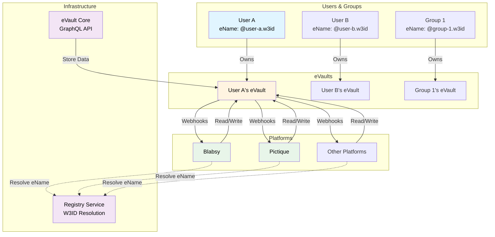
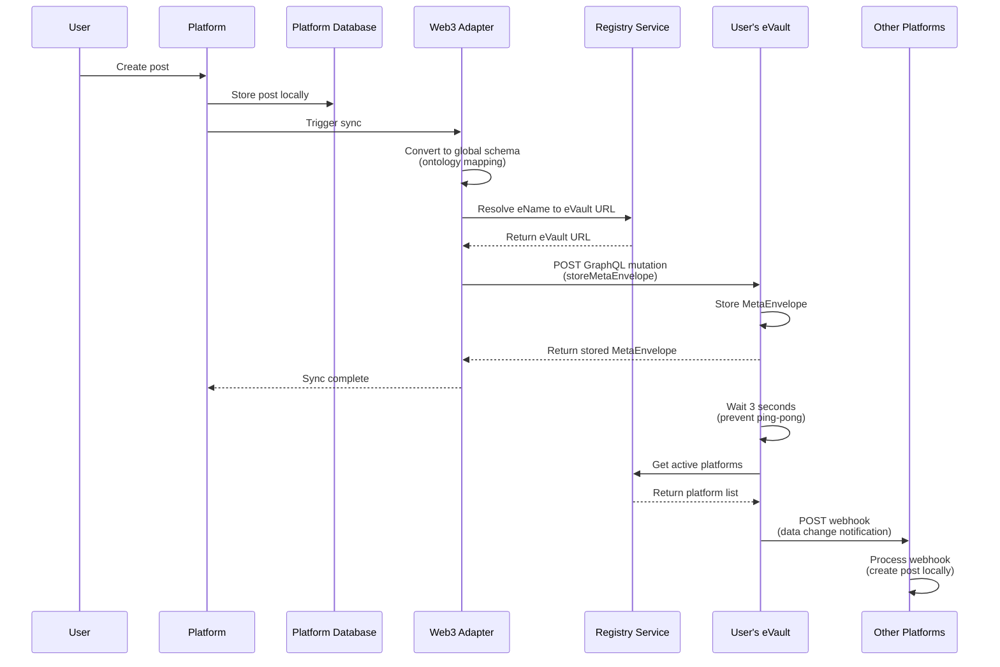
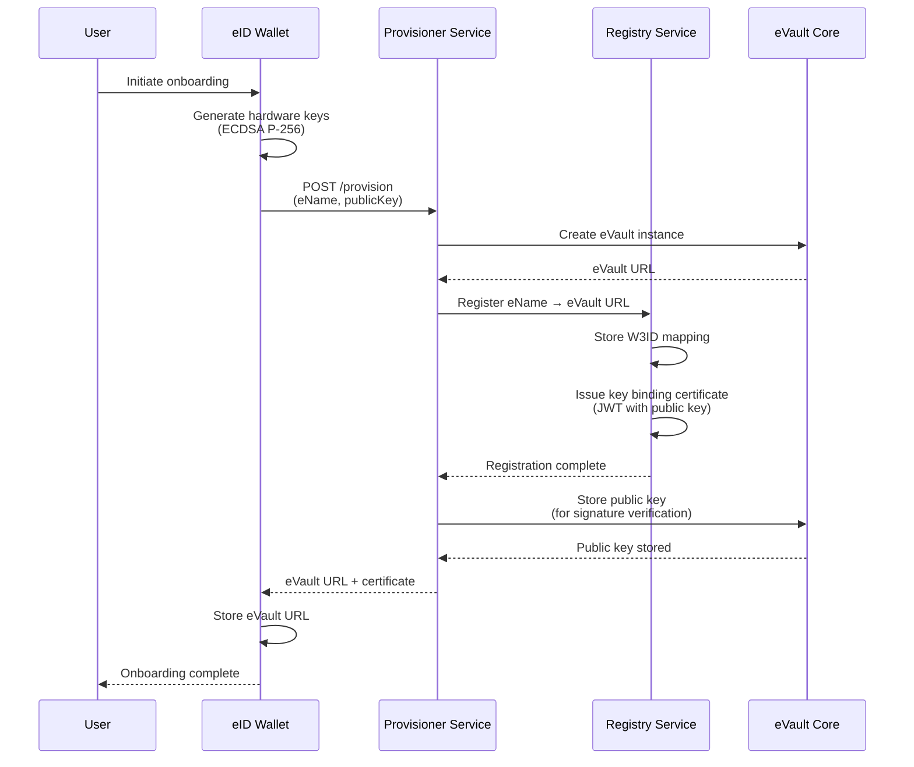

# Getting Started with W3DS

Welcome to **W3DS (Web 3.0 Data Spaces)** — a decentralized data synchronization protocol that puts users in control of their data. For definitions of key terms (eVault, W3ID, MetaState, Post-Platform, etc.), see the [Glossary](/docs/W3DS%20Basics/glossary).

## What is W3DS?

W3DS is a protocol that enables seamless data synchronization across multiple platforms while ensuring users own and control their data. Instead of platforms storing user data in silos, W3DS allows users to store their data in their own [**eVaults**](/docs/W3DS%20Basics/glossary#evault) and have platforms sync from these vaults.

## Core Concept

The fundamental principle of W3DS is simple: **Users, groups, and objects own their own eVaults**. All data about a person, group, or object is stored in their eVault, and platforms act as frontends that display and interact with this data, while also serving as caches and aggregators for improved performance and user experience.

### Key Principles

1. **Data Ownership & Decentralized Storage**: Users own their data, not platforms. Each user has their own eVault for data storage, ensuring true data ownership and control.

2. **Platform Independence & Automatic Synchronization**: Platforms are interchangeable frontends that automatically synchronize data, while also serving as caches and aggregators. Data created on one platform automatically appears on all platforms, enabling true interoperability across the ecosystem.

## How It Works: A Simple Example

Imagine User A creates a post on **Blabsy** (a social media platform):

1. User A posts "Hello, world!" on Blabsy
2. Blabsy's Web3 Adapter syncs the post to User A's eVault
3. User A's eVault stores the post and notifies all registered platforms
4. **Pictique** (another social media platform) receives the notification
5. Pictique creates the post locally - User A's post automatically appears on Pictique through the synchronization system

This is the power of W3DS: your data follows you across all platforms automatically.

## Architecture Overview



## Key Components

### eVault Core

The [eVault Core](/docs/Infrastructure/eVault) is the central storage system that manages user data. It provides:

- **GraphQL API** for storing and retrieving data using MetaEnvelope storage for structured data
- **Webhook delivery** to notify platforms of data changes
- **Access control** via ACLs (Access Control Lists)

### Web3 Adapter

The [Web3 Adapter](/docs/Infrastructure/Web3-Adapter) is a library that platforms use to:

- Handle bidirectional data synchronization between local databases and eVaults
- Convert between platform-specific schemas and global ontology schemas

### Registry Service

The [Registry Service](/docs/Infrastructure/Registry) provides:

- **W3ID resolution**: Maps eNames (like `@user-a.w3id`) to eVault URLs
- **Key binding certificates**: Stores user public keys for signature verification (used when platforms verify user signatures during authentication). See [eVault — Key Binding Certificates](/docs/Infrastructure/eVault#key-binding-certificates) and [Registry](/docs/Infrastructure/Registry).
- **Platform registration**: Tracks active platforms for webhook delivery

### Platforms

**Platforms** are applications that:

- Display and interact with user data
- Act as caches and aggregators for improved performance
- Sync data to/from user eVaults
- Convert between local and global data schemas
- Handle webhooks to receive data updates

## Data Flow

When a user creates data on a platform:

```text
User Action → Platform Database → Web3 Adapter → User's eVault → Webhooks → All Platforms
```

1. **User Action**: User creates a post, message, or other data
2. **Platform Database**: Platform stores data locally
3. **Web3 Adapter**: Adapter converts data to global schema and syncs to eVault
4. **User's eVault**: eVault stores the data as a [MetaEnvelope](/docs/Infrastructure/eVault#data-model)
5. **Webhooks**: eVault sends webhooks to all registered platforms (except the originating one)
6. **All Platforms**: Other platforms receive webhooks and create the data locally

> **Note**: This is a simplified overview of the data flow. The current implementation uses a basic webhook delivery mechanism. For production deployments, platforms should implement message delivery queues to handle eVault and platform downtime gracefully, ensuring reliable data synchronization.

### Detailed Data Flow Sequence

The following sequence diagram shows the detailed interactions between components, including the Web3 Adapter's internal implementation:



### Registration Sequence

The following sequence diagram shows how a new user registers and creates their eVault, illustrating the roles of the [Provisioner](/docs/W3DS%20Basics/Links) (production URL) and [Registry](/docs/Infrastructure/Registry) services:



The [Provisioner](/docs/W3DS%20Basics/Links) hosts `/provision`; the [Registry](/docs/Infrastructure/Registry) resolves eNames and issues key binding certificates; [eVault Core](/docs/Infrastructure/eVault) stores user data.

## Next Steps

- Learn more about [W3DS Basics](/docs/W3DS%20Basics/getting-started) - Deep dive into eVault ownership and data flow
- Understand [Authentication](/docs/W3DS%20Protocol/Authentication) - How users authenticate with platforms
- Learn about [Signing](/docs/W3DS%20Protocol/Signing) - Signature creation and verification
- Explore [Signature Formats](/docs/W3DS%20Protocol/Signature-Formats) - Technical details on cryptographic signatures
- Build a platform with the [Post Platform Guide](/docs/Post%20Platform%20Guide/getting-started) - Step-by-step guide to creating a W3DS-compatible platform
