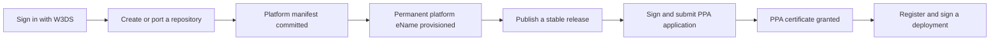

# GitW3 overview

[GitW3](https://git.w3ds.metastate.foundation) is the W3DS-aware Git forge. It hosts source code and normal collaborative Git workflows, while connecting a platform repository to its permanent W3DS identity, published versions, PPA certificates, and verifiable deployment records.

GitW3 is built around one rule: the repository is the source of truth for the platform metadata that W3DS publishes. The metadata lives beside the code in `.w3ds/platform.json`, and changes made from the GitW3 **W3DS** tab become ordinary commits on the default branch.

## What GitW3 manages

| Item | Meaning | Where you work with it |
| --- | --- | --- |
| Repository | Source code, issues, pull requests, tags, and releases | The regular repository tabs and Git |
| Platform manifest | Version-controlled W3DS metadata | `.w3ds/platform.json` and the **W3DS** tab |
| Platform eName | The permanent identity of the platform across releases | Provisioned automatically and shown on the **W3DS** tab |
| Version eName | The identity of one exact released version | Derived from a stable Git release |
| PPA certificate | Approval for one exact platform version | Apply and follow the review from the **W3DS** tab |
| Deployment eName | A verifiable record of one running deployment | Created from the **Deploy** tab |

The platform eName remains stable when the code, release, or deployment changes. Each released software version and each deployment receives its own identity so that W3DS records can refer to an exact artifact or running instance.

:::important GitW3 records deployments; it does not host them

The **Deploy** flow creates W3DS identities and attestations. Continue using your normal hosting provider or deployment pipeline to run the application.

:::

## The normal platform lifecycle



Identity and profile publication happen asynchronously. Git pushes and repository creation do not wait synchronously for every W3DS service. The status shown on the **W3DS** tab updates as the publisher completes or retries the work.

## Choose the right starting path

- **Make a new platform** creates a repository, an initial README, and `.w3ds/platform.json`. Use it when the application does not already have a W3DS identity.
- **Port an existing app** creates an empty destination first. You then move the existing Git history and W3DS integration, transfer an existing eName if there is one, and explicitly activate the public cutover.
- A regular code import is not the same as porting a W3DS platform. Use the guided port flow when an existing platform identity must remain intact.

Continue with [Sign in and manage your account](./sign-in-and-account), [Create a new platform](./create-a-platform), or [Port an existing application](./port-an-existing-application).

## Before you begin

You need:

- an eID wallet with a W3DS identity;
- Git installed locally if you will clone or push code;
- an SSH key or a GitW3 personal access token for command-line Git authentication; and
- repository owner or organization permissions for actions such as PPA submission and migration activation.

For application integration work, GitW3 can give a supported coding agent the current W3DS skill:

```bash
npx skills add MetaState-Prototype-Project/prototype@w3ds
```

The skill helps the agent use current protocol concepts and ontology identifiers. It does not replace review, tests, or secret handling.
