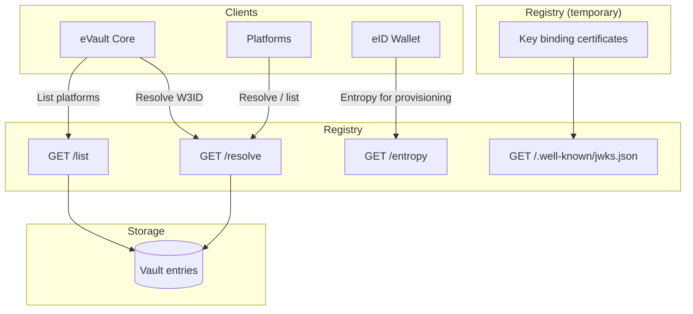

# Registry

The Registry is a core W3DS service that provides W3ID-based service discovery, entropy generation for cryptographic operations, and—as a temporary shortcut—key binding certificates. In the future, key binding will be provided by a Remote Notary (Remote CA).

## Overview

The Registry enables clients and services to:

- **Resolve W3IDs** to service endpoints (eVault URIs, platform URLs)
- **Obtain entropy** as signed JWTs for use in provisioning and other operations
- **Verify tokens** via a public JWK endpoint

:::warning Remote Notary / Remote CA

**Key binding certificates** are intended to be provided by a **Remote Notary** (Remote CA) in the future. The Registry currently provides them as a **shortcut** for the prototype. This function will be performed by a remote CA later; treat the Registry’s current behavior as temporary.

:::

## Architecture



## Service discovery

### GET /resolve?w3id=\<w3id\>

Resolves a W3ID to the associated service details (eVault or platform endpoint).

**Query parameter**: `w3id` (required) — the W3ID to resolve (e.g. `@user.w3id` or a service identifier).

**Response** (200):

```json
{
    "ename": "@user.w3id",
    "uri": "https://resolved-service.example.com",
    "evault": "evault-identifier",
    "originalUri": "https://...",
    "resolved": false
}
```

- **404**: No vault entry found for the given W3ID.
- **400**: Missing `w3id` parameter.

eVault and platforms use this to find where a user’s eVault or a platform’s API is hosted. See [eVault](/docs/Infrastructure/eVault) for how resolution is used in access control and webhook delivery.

### GET /list

Returns all registered vault entries (ename, uri, evault) with URIs resolved (e.g. for health checks or discovery). No authentication required.

**Response** (200): Array of objects with `ename`, `uri`, `evault`, `originalUri`, `resolved`.

## Entropy

### GET /entropy

Returns a signed JWT containing 20 alphanumeric characters of cryptographically secure entropy. Used by the eID Wallet and provisioning flows (e.g. when creating a new eVault).

**Response** (200):

```json
{
    "token": "eyJhbGciOiJFUzI1NiIs..."
}
```

**Token payload** (inside the JWT):

- `entropy`: 20-character alphanumeric string
- `iat`, `exp`: Issued at and expiration (valid for 1 hour)

**Signing**: ES256. Verify using the public key from `GET /.well-known/jwks.json`.

## JWK discovery

### GET /.well-known/jwks.json

Returns the JSON Web Key Set (JWK) used to sign entropy tokens and key binding certificates. Clients use this to verify JWTs issued by the Registry.

**Response** (200): Standard JWK set (e.g. EC P-256, ES256, `use: "sig"`).

## Key binding certificates (temporary)

The Registry can issue **key binding certificates**: JWTs that bind a W3ID (eName) to a public key. eVault uses these when storing and serving public keys (e.g. via `/whois`). Platforms verify signatures using the public key from the certificate and validate the certificate using the Registry’s JWKS.

**Flow**:

1. eVault (or provisioning) stores a user’s public key and requests a key binding certificate from the Registry (internal/protected flow).
2. The certificate is stored and later served (e.g. in eVault’s `/whois` response).
3. Platforms fetch certificates and verify them with the Registry’s public key.

**Certificate payload** (inside the JWT): `ename`, `publicKey`, `iat`, `exp` (e.g. 1 hour).

:::warning

Key binding attestation will be performed by a **Remote CA** in the future. The Registry currently issues these certificates as a shortcut.

:::

See [eVault — Key Binding Certificates](/docs/Infrastructure/eVault#key-binding-certificates) for how eVault uses them.

## Data model (high level)

The Registry stores **vault entries** used for resolution. Each entry conceptually has:

- **ename**: W3ID (e.g. `@user.w3id` or service identifier)
- **uri**: Service endpoint URL (resolved at runtime, e.g. with health checks)
- **evault**: eVault identifier for routing

Entropy and key binding tokens are JWTs signed with ES256; structure is described in the sections above. Registration and management of vault entries are internal and not documented as part of the public API.

## Integration

- **eVault**: Calls Registry to resolve W3IDs (access control, webhook targets), and uses key binding certificates for `/whois`. See [eVault](/docs/Infrastructure/eVault) and [Authentication](/docs/W3DS%20Protocol/Authentication).
- **eID Wallet**: Uses `/entropy` during provisioning. Verifies JWTs using `/.well-known/jwks.json`.
- **Platforms**: Use `/resolve` and `/list` for discovery. Verify tokens with the Registry’s JWKS.

## References

- [eVault](/docs/Infrastructure/eVault) — Resolution, key binding, and webhook delivery
- [Authentication](/docs/W3DS%20Protocol/Authentication) — How platforms authenticate users
- [Signing](/docs/W3DS%20Protocol/Signing) — Signature verification using eVault keys
