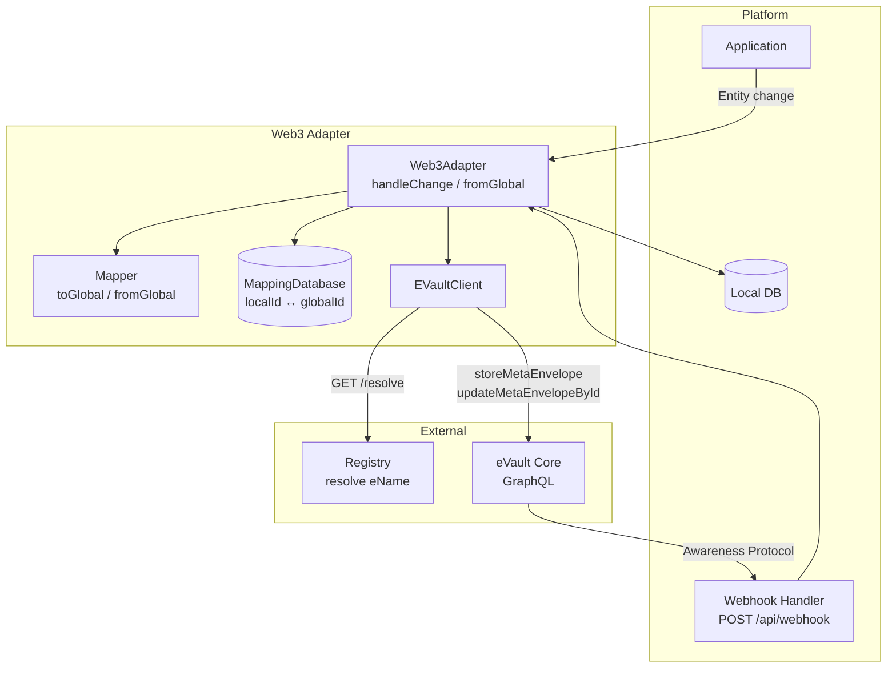
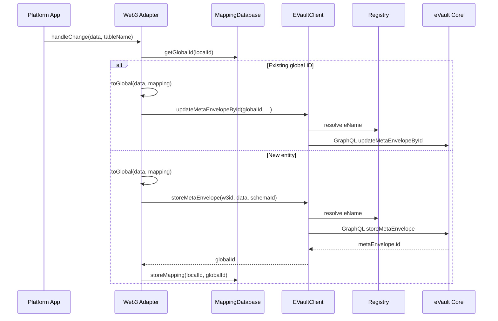

# Web3 Adapter

The Web3 Adapter is the bridge between a platform's local database and the W3DS global ontology. It enables "write once, sync everywhere": when data changes locally, the adapter converts it to the global schema and stores it in the owner's eVault; when awareness protocol packets arrive from other platforms, the adapter converts them back to the local schema and applies them locally.

## Overview

Platforms keep their own schemas and databases. To participate in W3DS, they need a component that:

- **Outbound**: Detects local changes, maps local data to the global ontology, resolves the owner's eVault (via [W3ID](/docs/W3DS%20Basics/W3ID) / Registry), and writes to the eVault (GraphQL).
- **Inbound**: Receives awareness protocol packets at `POST /api/webhook`, maps global data to the local schema, and creates or updates local entities while maintaining global-ID-to-local-ID mappings.

The Web3 Adapter implements this bridge. Understanding its core ideas helps you design better ontologies, mappings, and consistency strategies.

### Key Features

- **Bidirectional mapping**: Local schema ↔ global ontology via JSON mapping configs.
- **ID mapping**: Stores pairs of (localId, globalId) so the same entity is recognized across sync and webhooks.
- **eVault client**: Resolves [eNames](/docs/W3DS%20Basics/W3ID) via the Registry, obtains platform tokens, and calls eVault GraphQL (store/update) with retries and health checks.
- **Change handling**: `handleChange` is the main entry for outbound sync; webhook handlers use `fromGlobal` for inbound.

## Theory: Core Ideas

### 1. Universal ontology as the common language

All platforms agree on a small set of global schemas (e.g. User, Post, Group) identified by UUIDs. Each platform maps its local tables to these schemas. The ontology is the contract: if you store data in that shape in an eVault, other platforms can interpret it via their own mappings. Better ontology design (versioning, optional fields, extensibility) leads to easier evolution and fewer breaking changes.

### 2. Per-entity owner eVault (W3ID)

Every piece of data has an "owner" — the [eName](/docs/W3DS%20Basics/W3ID) of the eVault where it lives. The adapter uses `ownerEnamePath` in the mapping to determine the owner from the local entity (e.g. a direct field `ename` or a nested path like `user(createdBy.ename)`). Data is always written to that owner's eVault. This keeps ownership explicit and supports ACLs and multi-tenant resolution.

### 3. Bidirectional mapping and ID mapping

- **Field mapping**: `localToUniversalMap` defines how each local field maps to a global field (including relations and special functions like `__date`, `__calc`). The same map is used in both directions: `toGlobal` for outbound, `fromGlobal` for inbound.
- **ID mapping**: A separate store (e.g. SQLite `MappingDatabase`) holds `(globalId, localId)`. When syncing out, after a successful `storeMetaEnvelope` the adapter stores the new global ID against the local ID. When a webhook arrives, the adapter looks up the global ID to decide whether to create or update the local entity and then stores or updates the mapping. Without this, the same logical entity could be duplicated or never linked across platforms.

### 4. Change detection on the platform side

The adapter does not poll the database. The platform must detect changes (e.g. via ORM hooks, DB triggers, or application events) and call `handleChange({ data, tableName, participants })`. So the core idea is: the platform owns the trigger; the adapter owns the translation and eVault write. Better detection (e.g. transactional outbox, CDC) can improve consistency and avoid missed or duplicate syncs.

### 5. Webhooks (Awareness Protocol) propagate to other platforms

After data is stored or updated in an eVault, the [Awareness Protocol](/docs/W3DS%20Protocol/Awareness-Protocol) delivers webhooks to all other registered platforms. Those platforms use the same adapter's `fromGlobal` and ID mapping to apply the change locally. So the full loop is: Platform A → adapter → eVault → Awareness Protocol → Platform B's webhook → adapter → Platform B's DB.

### Design implications

You can get better results by:

- **Ontology design**: Clear schema versioning, optional vs required fields, and conventions for references (e.g. eNames vs local IDs in payloads).
- **Mapping expressiveness**: Richer `ownerEnamePath` (e.g. fallbacks), relation resolution, and handling of arrays and nested structures.
- **Conflict handling**: The current implementation is last-write-wins via eVault updates; you could add version fields, conflict resolution, or merge strategies.
- **Eventual consistency**: The system does not guarantee ordering or at-least-once delivery of webhooks; you could add idempotency keys, retries, or acknowledgments.

## Architecture

## Implementation

### Components

- **Web3Adapter** (`infrastructure/web3-adapter`): Main class. Loads mapping configs from JSON files, owns `MappingDatabase` and `EVaultClient`, and exposes `handleChange` and `fromGlobal`. Config includes `schemasPath`, `dbPath`, `registryUrl`, `platform` (name used for platform token).
- **EVaultClient** (`src/evault/evault.ts`): Resolves eName to GraphQL endpoint via Registry `GET /resolve?w3id=`, obtains platform token via `POST /platforms/certification`, caches clients per eName, and performs health checks (`HEAD /whois`). Uses retries and timeouts for store/update/fetch.
- **Mapper** (`src/mapper/mapper.ts`): `toGlobal({ data, mapping, mappingStore })` and `fromGlobal(...)` using `IMapping` and `MappingDatabase` for resolving relation IDs.
- **MappingDatabase** (`src/db/mapping.db.ts`): SQLite store for `(local_id, global_id)`. Methods: `storeMapping`, `getLocalId(globalId)`, `getGlobalId(localId)`.

### Flow: Outbound (local change → eVault)

1. Platform detects a change and calls `adapter.handleChange({ data, tableName, participants })`.
2. Adapter loads the mapping for `tableName`; if missing or `readOnly`, returns.
3. If a global ID already exists for this local ID, adapter calls `toGlobal`, then `evaultClient.updateMetaEnvelopeById(existingGlobalId, { ... })` (fire-and-forget). Optionally uses `lockedIds` to avoid re-entrant sync from webhooks.
4. If no global ID yet, adapter calls `toGlobal` to get owner eName and global-shaped payload. If no owner, returns. Otherwise calls `evaultClient.storeMetaEnvelope({ id: null, w3id, data, schemaId })`, then `mappingDb.storeMapping({ localId, globalId })`. If `participants` includes other eNames, adapter may call `storeReference(ownerEvault/globalId, otherEvault)` for each.
5. [Awareness Protocol](/docs/W3DS%20Protocol/Awareness-Protocol) later delivers webhooks to other platforms; the originating platform is excluded.

### EVaultClient details

- **Resolution**: `GET /resolve?w3id=@...` → response `{ uri }` → GraphQL endpoint is `uri + "/graphql"`.
- **Caching**: One GraphQL client per eName; if health check fails (e.g. `HEAD /whois`), client is evicted and re-resolved next time.
- **Retries**: Configurable for store/update/fetch; typically no retry on 4xx.

### Mapping configuration (IMapping)

Mapping configs define how local fields map to the global ontology. For the full syntax (direct fields, relations, arrays, `__date`, `__calc`, owner path), see the **Web3 Adapter Mapping Rules** in the repository at `infrastructure/web3-adapter/MAPPING_RULES.md`.

Each mapping is a JSON file with:

- **tableName**: Local table (or entity) name.
- **schemaId**: Global ontology UUID.
- **ownerEnamePath**: Path to the owner eName in the local entity (e.g. `"ename"` or `"users(createdBy.ename)"`). Supports fallbacks with `||`.
- **localToUniversalMap**: Object mapping local field names to global field names or expressions (e.g. `"createdAt": "__date(createdAt)"`, relation syntax `"tableName(path),globalAlias"`).
- **readOnly** (optional): If true, `handleChange` does not sync this table to the eVault.

For full syntax (direct, relation, array, `__date`, `__calc`, owner path), see the mapping rules in the repository at `infrastructure/web3-adapter/MAPPING_RULES.md`.

### Receiving data (inbound)

When a platform receives an awareness protocol packet at `POST /api/webhook`:

1. Parse body: `id`, `w3id`, `schemaId`, `data`.
2. Find the mapping whose `schemaId` matches (or map by schema UUID to table name).
3. Call `adapter.fromGlobal({ data: body.data, mapping })` to get local-shaped data.
4. Call `mappingDb.getLocalId(body.id)`; if found, update the existing local entity; otherwise create and then `mappingDb.storeMapping({ localId: newEntity.id, globalId: body.id })`.
5. Return 200.

See the [Webhook Controller Guide](/docs/Post%20Platform%20Guide/webhook-controller) for a full implementation example.

## Sequence: Platform → Adapter → eVault

## Extension points

- **Ontology versioning**: Today `schemaId` is a single UUID; you could version schemas and map multiple local tables to different versions.
- **Conflict resolution**: Add version or timestamp fields and resolve conflicts in the adapter or in a separate service.
- **Idempotency**: Use idempotency keys in payloads or in the mapping DB to make webhook handling and outbound sync idempotent.
- **ID mapping storage**: Replace SQLite with a shared store if multiple instances of the platform need the same mappings.
- **Transactional outbox**: Have the platform write changes to an outbox table and have a worker call `handleChange` so that sync is tied to the same transaction as the local write.
