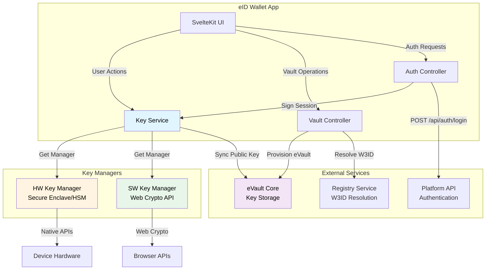

# eID Wallet

The eID Wallet is a mobile application that manages cryptographic keys, authenticates users with platforms, and provides the user interface for eVault creation and management.

## Overview

The eID Wallet is a **Tauri-based mobile application** (built with SvelteKit and TypeScript) that serves as the primary interface for users in the W3DS ecosystem. It uses secure cryptographic enclaves on modern mobile devices to store and manage private keys without exposing them.

### Key Features

- **Key Management**: Generate and manage ECDSA P-256 key pairs
- **Hardware Security**: Uses device cryptographic enclaves (Secure Enclave on iOS, Hardware Security Module on Android)
- **eVault Creation**: User interface for provisioning new eVaults
- **Platform Authentication**: Sign session IDs for platform login
- **Signature Creation**: Sign arbitrary payloads for various use cases
- **Key Rotation**: Support for rotating keys in case of security incidents
- **Multi-Device Support**: Keys can be synced across devices

## Architecture



## Key Management

The eID Wallet manages cryptographic keys through a flexible key manager system.

### Key Manager Types

#### Hardware Key Manager

Uses device-native cryptographic APIs:

- **iOS**: Secure Enclave via LocalAuthentication framework
- **Android**: Hardware Security Module (HSM) via KeyStore API
- **Benefits**: Private keys never leave the secure hardware
- **Limitations**: Device-specific, cannot export keys

#### Software Key Manager

Uses Web Crypto API:

- **Storage**: Keys stored in browser's secure storage
- **Benefits**: Works on all platforms, can be exported
- **Limitations**: Less secure than hardware keys

### Key Manager Selection

The wallet automatically selects the appropriate key manager:

1. **Pre-verification Mode**: Always uses software keys (for testing/fake users only)
2. **Real KYC/Verification**: Always uses hardware keys (never software keys)
3. **Hardware Available**: Prefers hardware keys, falls back to software only if hardware is unavailable
4. **Explicit Request**: Can force hardware or software based on configuration

### Key Contexts

Keys are organized by **context** to support different use cases:

- **onboarding**: Keys used during eVault creation
- **pre-verification**: Keys used before identity verification
- **signing**: Keys used for general signing operations

### Default Key

The wallet uses a default key with ID `"default"` for most operations. This ensures consistency across the application.

## Key Operations

### Generate Key

Generate a new ECDSA P-256 key pair:

**Process**:
1. Determine key manager (hardware or software)
2. Generate key pair using appropriate API
3. Store key identifier (not the private key itself)
4. Return public key

**Implementation**:
- Hardware: Uses device-native key generation
- Software: Uses `crypto.subtle.generateKey()` with ECDSA P-256 parameters

### Get Public Key

Retrieve the public key for a given key ID:

**Process**:
1. Load key manager for the key ID
2. Extract public key from key pair
3. Encode as multibase format
4. Return public key string

**Format**: Multibase-encoded (starts with 'z' for base58btc or 'm' for base64)

### Sign Payload

Sign a string payload with a private key:

**Process**:
1. Convert payload string to UTF-8 bytes
2. Compute SHA-256 hash
3. Sign hash with ECDSA P-256
4. Encode signature (base64 for software, multibase for hardware)
5. Return signature string

**Algorithm**: ECDSA P-256 with SHA-256

**Signature Format**:
- Software keys: Base64-encoded 64-byte raw signature
- Hardware keys: Multibase base58btc-encoded signature

### Verify Signature

Verify a signature against a payload (for testing):

**Process**:
1. Get public key for key ID
2. Decode signature
3. Hash payload with SHA-256
4. Verify signature using ECDSA P-256
5. Return boolean result

## User Journeys

### Onboarding and eVault Creation

When a new user first opens the wallet:

1. **Generate Keys**: Create default key pair (hardware keys for real users, software keys only for pre-verification/test users)
2. **Request Entropy**: Get entropy token from Registry
3. **Generate Namespace**: Create UUID for namespace
4. **Provision eVault**: Send provision request with public key
5. **Receive Credentials**: Get W3ID (eName) and eVault URI
6. **Store Locally**: Save credentials in wallet storage

**API Flow**:
```
Wallet → Registry: GET /entropy
Registry → Wallet: JWT entropy token
Wallet → Provisioner: POST /provision (entropy, namespace, publicKey)
Provisioner → Registry: Request key binding certificate
Registry → Provisioner: JWT certificate
Provisioner → Wallet: w3id, evaultUri
```

**Note**: The `/provision` endpoint is part of the Provisioner service, not eVault Core.

### Platform Authentication

When a user wants to log into a platform:

1. **Scan QR Code**: Platform displays QR code with `w3ds://auth` URI
2. **Parse URI**: Extract session ID and redirect URL
3. **Sign Session**: Sign session ID with default key
4. **Send to Platform**: POST signed session to platform's `/api/auth/login`
5. **Receive Token**: Platform verifies signature and returns auth token

**Signing Details**:
- Uses key ID `"default"`
- Uses context `"onboarding"` for real users (always hardware keys) or `"pre-verification"` for fake/test users (software keys)
- For real KYC-verified users: Always uses hardware keys, never software keys
- Signs the exact session ID string (UUID)
- Returns base64 or multibase-encoded signature

### Key Rotation

When a user needs to rotate their keys (security incident, device loss):

1. **Generate New Key**: Create new key pair
2. **Sync to eVault**: Send new public key to eVault
3. **Update Certificates**: eVault requests new key binding certificate
4. **Revoke Old Key**: Optionally revoke old key (if supported)

**Note**: The W3ID (eName) remains the same - only the keys change.

## Public Key Syncing

Public keys must be synced to eVault so platforms can verify signatures.

### Sync Process

1. **Get Public Key**: Retrieve public key from key manager
2. **Format**: Ensure public key is in multibase format
3. **Send to eVault**: POST to eVault's key storage endpoint
4. **Certificate Generation**: eVault requests key binding certificate from Registry
5. **Storage**: Certificate stored in eVault for future verification

### Sync Timing

- **During Provisioning**: Public key included in `/provision` request
- **After Key Rotation**: Manual sync required
- **Multi-Device**: Each device syncs its own public key

## Signature Creation

The wallet creates signatures for various purposes:

### Authentication Signatures

**Purpose**: Prove identity to platforms

**Payload**: Session ID (UUID string)

**Process**:
1. Platform generates session ID
2. Wallet receives session ID via `w3ds://auth` URI
3. Wallet signs session ID with default key
4. Wallet sends signature to platform

### Document Signatures

**Purpose**: Sign documents, contracts, or other data

**Payload**: Arbitrary string (document hash, JSON, etc.)

**Process**:
1. User initiates signing action
2. Wallet receives payload to sign
3. Wallet signs payload with appropriate key
4. Wallet returns signature to application

### Voting Signatures

**Purpose**: Sign votes in voting systems

**Payload**: Vote session ID or vote data

**Process**: Similar to document signatures, but with vote-specific payloads

## Security Considerations

### Private Key Protection

- **Hardware Keys**: Private keys never leave secure hardware
- **Software Keys**: Stored in browser's secure storage (encrypted at rest)
- **No Export**: Private keys cannot be exported (security requirement)
- **Biometric Protection**: Hardware keys require biometric authentication

### Key Rotation

- **Trigger Events**: Device loss, suspected compromise, user request
- **Process**: Generate new key, sync to eVault, optionally revoke old key
- **W3ID Persistence**: eName remains unchanged after rotation

### Multi-Device Support

- **Per-Device Keys**: Each device has its own key pair
- **Multiple Certificates**: eVault can store multiple key binding certificates
- **Verification**: Platforms try all certificates until one succeeds

## Implementation Details

### Technology Stack

- **Framework**: Tauri (Rust + Web frontend)
- **Frontend**: SvelteKit + TypeScript
- **Key APIs**: 
  - iOS: LocalAuthentication (Secure Enclave)
  - Android: KeyStore (HSM)
  - Web: Web Crypto API

### Key Service Architecture

```typescript
KeyService
  ├── KeyManagerFactory
  │   ├── HardwareKeyManager
  │   └── SoftwareKeyManager
  ├── Key Storage (encrypted)
  └── Context Management
```

### Key Manager Interface

All key managers implement:

```typescript
interface KeyManager {
    exists(keyId: string): Promise<boolean>;
    generate(keyId: string): Promise<string | undefined>;
    getPublicKey(keyId: string): Promise<string | undefined>;
    signPayload(keyId: string, payload: string): Promise<string>;
    verifySignature(keyId: string, payload: string, signature: string): Promise<boolean>;
    getType(): "hardware" | "software";
}
```

## API Integration

### eVault Provisioning

```typescript
// Request entropy from Registry
const entropyResponse = await fetch(`${registryUrl}/entropy`);
const entropyToken = await entropyResponse.json();

// Generate namespace
const namespace = uuidv4();

// Provision eVault with public key
// Note: Real users always use hardware keys (context: "onboarding")
// Pre-verification/test users use software keys (context: "pre-verification")
const publicKey = await keyService.getPublicKey("default", "onboarding");
const provisionResponse = await fetch(`${provisionerUrl}/provision`, {
    method: "POST",
    body: JSON.stringify({
        registryEntropy: entropyToken,
        namespace: namespace,
        verificationId: verificationCode,
        publicKey: publicKey
    })
});

const { w3id, uri } = await provisionResponse.json();
```

**Note**: The `/provision` endpoint is hosted by the Provisioner service, not eVault Core.

### Platform Authentication

```typescript
// Parse w3ds://auth URI
const uri = new URL(authUri);
const sessionId = uri.searchParams.get("session");
const redirectUrl = uri.searchParams.get("redirect");

// Sign session ID
const signature = await keyService.signPayload(
    "default",
    "onboarding",
    sessionId
);

// Send to platform
const response = await fetch(redirectUrl, {
    method: "POST",
    body: JSON.stringify({
        ename: vault.ename,
        session: sessionId,
        signature: signature,
        appVersion: "0.4.0"
    })
});

const { token } = await response.json();
```

## Troubleshooting

### Common Issues

1. **Hardware keys not available**
   - Check device support (iOS 9+, Android 6+)
   - Verify biometric authentication is set up
   - **Note**: Real KYC-verified users must use hardware keys. Software keys are only for pre-verification/test users
   - If hardware is unavailable, the wallet will fallback to software keys, but this should not happen for verified users

2. **Signature verification fails**
   - Ensure using correct key ID and context
   - Verify public key was synced to eVault
   - Check signature encoding format

3. **Key generation fails**
   - Check device storage space
   - Verify cryptographic APIs are available
   - For real users: Hardware key generation must succeed (software fallback not acceptable)
   - For pre-verification/test users: Software key manager can be used as fallback

## References

- [Authentication](/docs/W3DS%20Protocol/Authentication) - How wallet authentication works
- [Signing](/docs/W3DS%20Protocol/Signing) - Signature creation details
- [Signature Formats](/docs/W3DS%20Protocol/Signature-Formats) - Technical signature format details
- [eVault](/docs/Infrastructure/eVault) - Where public keys are stored
