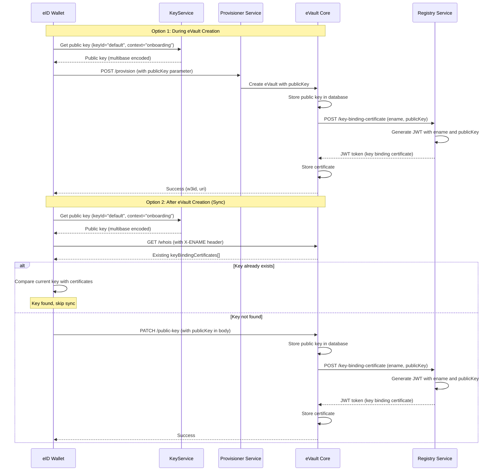

# eVault Key Delegation

This document explains how the eVault system delegates cryptographic keys for signing. It covers key generation, syncing public keys to eVault, and key binding certificates.

## Overview

The eVault system enables users to sign data using keys stored in their [eID wallet](/docs/Infrastructure/eID-Wallet). The public keys are synced to [eVault](/docs/Infrastructure/eVault) and bound to the user's eName (W3ID) through [key binding certificates](/docs/Infrastructure/eVault#key-binding-certificates) (issued by the [Registry](/docs/Infrastructure/Registry)). This allows any service to verify signatures by retrieving the public key from eVault.

## Key Delegation Flow

### Key Generation

Keys are generated in the eID wallet during onboarding or pre-verification. The system supports two types of key managers:

1. **Hardware Key Manager**: Uses Native iOS/Android APIs for hardware-backed keys
2. **Software Key Manager**: Uses Web Crypto API to generate software keys

Both generate ECDSA P-256 key pairs with SHA-256 hashing.

The default key ID is `"default"` and is used for all signing operations.

### Setting Keys During eVault Creation

During the eVault provisioning process (onboarding), the public key can be set directly when creating the eVault. The `/provision` endpoint accepts an optional `publicKey` parameter:

**Provision Request:**
```http
POST /provision
Content-Type: application/json

{
  "registryEntropy": "<entropy-token>",
  "namespace": "<w3id>",
  "verificationId": "<verification-code>",
  "publicKey": "z3059301306072a8648ce3d020106082a8648ce3d03010703420004..."  // Optional
}
```

**Note**: The `publicKey` parameter is optional. It is required for user eVaults that need key binding for signature verification, but can be omitted for keyless eVaults (such as platform or group eVaults) that don't require cryptographic identity.

When provisioning a user eVault during onboarding, the eID wallet:
1. Generates or retrieves the public key using `getApplicationPublicKey()`
2. Includes the `publicKey` in the provision request
3. The eVault stores the public key and generates a key binding certificate automatically

This eliminates the need for a separate sync step when the eVault is first created.

For platform or group eVaults that don't need key binding, the `publicKey` can be omitted entirely.

### Syncing Public Keys to eVault

The public key syncing is an autonomous process done by the eID Wallet when linking new devices to the same eName.



### Key Binding Certificates

Key binding certificates are JWTs that cryptographically bind a public key to an eName. They are generated by the [Registry](/docs/Infrastructure/Registry) service and stored in [eVault](/docs/Infrastructure/eVault).

**Certificate Structure:**
- **Header**: `{ alg: "ES256", kid: "entropy-key-1" }`
- **Payload**: `{ ename: "@user.w3id", publicKey: "z..." }`
- **Signature**: Signed by Registry's private key (ES256)

The certificate can be verified using the Registry's JWKS endpoint at `/.well-known/jwks.json`.

### eVault Endpoints

The following endpoints are provided by [eVault](/docs/Infrastructure/eVault):

#### PATCH /public-key

Stores a public key in eVault for a given eName.

**Request:**
```http
PATCH /public-key
X-ENAME: @user.w3id
Authorization: Bearer <token>
Content-Type: application/json

{
  "publicKey": "z3059301306072a8648ce3d020106082a8648ce3d03010703420004..."
}
```

**Response:**
- `200 OK`: Public key stored successfully
- `400 Bad Request`: Missing X-ENAME header or invalid request
- `401 Unauthorized`: Invalid or missing authentication token

#### GET /whois

Retrieves key binding certificates for a given eName.

**Request:**
```http
GET /whois
X-ENAME: @user.w3id
```

**Response:**
```json
{
  "w3id": "@user.w3id",
  "evaultId": "evault-identifier",
  "keyBindingCertificates": [
    "eyJhbGciOiJFUzI1NiIsImtpZCI6ImVudHJvcHkta2V5LTEifQ.eyJlbmFtZSI6IkB1c2VyLnczaWQiLCJwdWJsaWNLZXkiOiJ6MzA1OTMwMTMwNjA3MmE4NjQ4Y2UzZDAyMDEwNjA4MmE4NjQ4Y2UzZDAzMDEwNzAzNDIwMDA0Li4uIn0..."
  ]
}
```

`evaultId` is the eVault instance identifier (when configured); it matches the `evault` value registered with the Registry.

## Code Examples

### Setting Public Key During eVault Creation

```typescript
// During onboarding - provision user eVault with public key
const publicKey = await getApplicationPublicKey(); // Get public key from KeyService

const provisionResponse = await axios.post(
  new URL("/provision", provisionerUrl).toString(),
  {
    registryEntropy,
    namespace: uuidv4(),
    verificationId,
    publicKey: publicKey, // Optional: include for user eVaults, omit for keyless eVaults
  }
);

// eVault is created with the public key already stored (if provided)
const { w3id, uri } = provisionResponse.data;
```

For keyless eVaults (platforms, groups), omit the `publicKey` parameter:

```typescript
// Provision a keyless eVault (e.g., for a platform or group)
const provisionResponse = await axios.post(
  new URL("/provision", provisionerUrl).toString(),
  {
    registryEntropy,
    namespace: uuidv4(),
    verificationId,
    // No publicKey - this is a keyless eVault
  }
);

const { w3id, uri } = provisionResponse.data;
```

### Syncing a Public Key to eVault (After Creation)

```typescript
// In eID wallet - sync public key to existing eVault
const vaultController = new VaultController(keyService, userController);
const eName = "@user.w3id";

// Sync public key (automatically checks if already exists)
await vaultController.syncPublicKey(eName);
```

### Retrieving Key Binding Certificates

```typescript
// Resolve eVault URL
const resolveUrl = new URL(
  `/resolve?w3id=${encodeURIComponent(eName)}`,
  registryBaseUrl
).toString();
const resolveResponse = await axios.get(resolveUrl);
const evaultUrl = resolveResponse.data.uri;

// Get certificates from eVault
const whoisUrl = new URL("/whois", evaultUrl).toString();
const whoisResponse = await axios.get(whoisUrl, {
  headers: { "X-ENAME": eName }
});

const certificates = whoisResponse.data.keyBindingCertificates;
// Array of JWT tokens
```

## Security Considerations

1. **Key Storage**: Private keys are never transmitted or stored in eVault. Only public keys are synced.

2. **Certificate Validity**: Key binding certificates expire after 1 hour. eVault regenerates them on-demand when requested.

3. **Multiple Keys**: Users can have multiple devices, each with its own key pair. All valid keys can verify signatures.

4. **Key Rotation**: When users add new devices, new keys are added without invalidating old ones, allowing graceful key rotation.

## References

- [eID Wallet](/docs/Infrastructure/eID-Wallet) - Key generation and syncing
- [eVault](/docs/Infrastructure/eVault) - Storage, `/whois`, and key binding
- [Registry](/docs/Infrastructure/Registry) - Key binding certificate issuance
