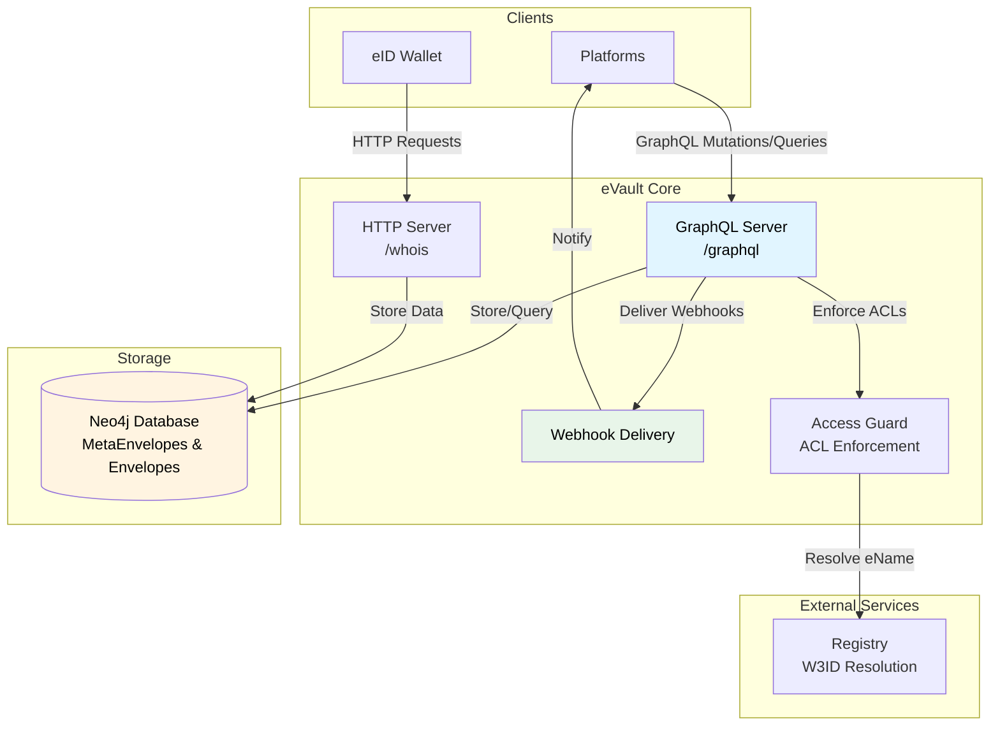

# eVault

eVault is the core storage system for W3DS. It provides a GraphQL API for storing and retrieving user data, manages access control, and delivers webhooks to platforms when data changes.

## Overview

An **eVault** is a personal data store identified by a [W3ID](/docs/W3DS%20Basics/W3ID). Each user, group, or object has their own eVault where all their data is stored in a standardized format called **MetaEnvelopes**.

### Key Features

- **GraphQL API**: Store, retrieve, update, and search data
- **Access Control**: ACL-based permissions for data access
- **Webhook Delivery**: Automatic notifications to platforms when data changes
- **Key Binding**: Stores user public keys (generated in the eID wallet) for signature verification

## Architecture

eVault Core consists of several components:



## Data Model

### MetaEnvelopes

A **MetaEnvelope** is the top-level container for an entity (post, user, message, etc.). It contains:

- **id**: Unique identifier (W3ID). Note: Only IDs registered in the Registry are guaranteed to be globally unique.
- **ontology**: Schema identifier (W3ID, e.g., "550e8400-e29b-41d4-a716-446655440001"). Schema W3IDs can be resolved to their schema definitions via the [Ontology](/docs/Infrastructure/Ontology) service. See [W3DS Basics](/docs/W3DS%20Basics/getting-started) for more information on ontology schemas.
- **acl**: Access Control List (who can access this data)
- **envelopes**: Array of individual Envelope nodes

### Envelopes

Each field in a MetaEnvelope becomes a separate **Envelope** node in Neo4j:

- **id**: Unique identifier
- **ontology**: The field name from the ontology schema (e.g., "content", "authorId", "createdAt") - this identifies which field in the schema this envelope represents
- **value**: The actual field value (string, number, object, array)
- **valueType**: Type of the value ("string", "number", "object", "array") - cached from the ontology schema for optimization purposes

### Storage Structure

In Neo4j, the structure looks like:

```cypher
(MetaEnvelope {id, ontology, acl}) -[:LINKS_TO]-> (Envelope {id, value, valueType})
```

This flat graph structure allows:
- Efficient field-level updates
- Flexible querying
- Easy reconstruction of the original object

**Trade-offs**:
- Increased storage overhead (each field becomes a separate node)
- More complex queries when reconstructing full objects
- Potential performance impact with deeply nested structures

## GraphQL API

eVault exposes a GraphQL API at `/graphql` for all data operations. 

### Queries

#### getMetaEnvelopeById

Retrieve a specific MetaEnvelope by its global ID.

**Query**:
```graphql
query {
  getMetaEnvelopeById(id: "global-id-123") {
    id
    ontology
    parsed
    envelopes {
      id
      ontology
      value
      valueType
    }
  }
}
```

**Headers Required**:
- `X-ENAME`: The W3ID of the eVault owner
- `Authorization: Bearer <token>`: Platform authentication token

#### findMetaEnvelopesByOntology

Find all MetaEnvelopes of a specific ontology type.

**Query**:
```graphql
query {
  findMetaEnvelopesByOntology(ontology: "550e8400-e29b-41d4-a716-446655440001") {
    id
    ontology
    parsed
  }
}
```

#### searchMetaEnvelopes

Search MetaEnvelopes by content within a specific ontology. The `term` parameter performs case-sensitive text matching against the string values in any of the envelopes within MetaEnvelopes of the specified ontology. The search looks for the term within envelope values (not field names).

**Query**:
```graphql
query {
  searchMetaEnvelopes(ontology: "550e8400-e29b-41d4-a716-446655440001", term: "hello") {
    id
    ontology
    parsed
  }
}
```

### Mutations

#### storeMetaEnvelope

Store a new MetaEnvelope in the eVault.

**Mutation**:
```graphql
mutation {
  storeMetaEnvelope(input: {
    ontology: "550e8400-e29b-41d4-a716-446655440001"
    payload: {
      content: "Hello, world!"
      mediaUrls: []
      authorId: "..."
      createdAt: "2025-01-24T10:00:00Z"
    }
    acl: ["*"]
  }) {
    metaEnvelope {
      id
      ontology
      parsed
    }
    envelopes {
      id
      value
      valueType
    }
  }
}
```

**Headers Required**:
- `X-ENAME`: The W3ID of the eVault owner (required)
- `Authorization: Bearer <token>`: Optional, but recommended for webhook delivery

**Response Structure**:

The `envelopes` array in the response contains one envelope per field in the payload, where each envelope's `ontology` field contains the field name from the schema. For example, storing a post with `content`, `authorId`, and `createdAt` fields produces:

```json
{
  "envelopes": [
    {
      "ontology": "content",
      "value": "Hello, world!"
    },
    {
      "ontology": "authorId",
      "value": "..."
    },
    {
      "ontology": "createdAt",
      "value": "2025-01-24T10:00:00Z"
    },
    {
      "ontology": "mediaUrls",
      "value": []
    }
  ],
  "id": "9a84e965-2604-52bf-97a7-5c4f4151fea2"
}
```

#### updateMetaEnvelopeById

Update an existing MetaEnvelope.

**Mutation**:
```graphql
mutation {
  updateMetaEnvelopeById(
    id: "global-id-123"
    input: {
      ontology: "550e8400-e29b-41d4-a716-446655440001"
      payload: {
        content: "Updated content"
        mediaUrls: []
      }
      acl: ["*"]
    }
  ) {
    metaEnvelope {
      id
      ontology
      parsed
    }
  }
}
```

#### deleteMetaEnvelope

Delete a MetaEnvelope and all its Envelopes.

**Mutation**:
```graphql
mutation {
  deleteMetaEnvelope(id: "global-id-123")
}
```

## HTTP API

### /whois

Get information about a W3ID, including key binding certificates.

**Request**:
```http
GET /whois HTTP/1.1
Host: evault.example.com
X-ENAME: @user-a.w3id
```

**Response**:
```json
{
    "keyBindingCertificates": [
        "eyJhbGciOiJFUzI1NiIsInR5cCI6IkpXVCJ9...",
        "eyJhbGciOiJFUzI1NiIsInR5cCI6IkpXVCJ9..."
    ]
}
```

**Use Case**: Platforms use this endpoint to retrieve public keys for signature verification.


## Access Control

eVault uses **Access Control Lists (ACLs)** to determine who can access data.

### ACL Format

ACLs are arrays of W3IDs or special values:

- `["*"]`: Public read access (anyone can read, but only the eVault owner can write)
- `["@user-a.w3id"]`: Only User A can access (read and write)
- `["@user-a.w3id", "@user-b.w3id"]`: User A and User B can access (read and write)

**Prototype Limitation**: In the current prototype implementation, ACLs provide all-or-nothing access. There is no read-only access without write access (except for `["*"]` which provides read-only access for everyone). More granular permissions are planned for future versions.

### Access Enforcement

The Access Guard middleware enforces ACLs:

1. **Extract W3ID**: From `X-ENAME` header or [Bearer token](/docs/W3DS%20Protocol/Authentication)
2. **Check ACL**: Verify the requesting W3ID is in the MetaEnvelope's ACL
3. **Filter Results**: Remove ACL field from responses (security)
4. **Allow/Deny**: Grant or deny access based on ACL

### Special Cases

- **storeMetaEnvelope**: Only requires `X-ENAME` (no Bearer token needed)
- **Public Data**: ACL `["*"]` allows any authenticated request
- **Private Data**: Only listed W3IDs can access

## Webhook Delivery

When data is stored or updated, eVault automatically sends webhooks to all registered platforms.

### Webhook Process

1. **Data Stored**: MetaEnvelope is stored in Neo4j
2. **Wait 3 Seconds**: Delay prevents webhook ping-pong (same platform receiving its own webhook)
3. **Get Active Platforms**: Query [Registry](/docs/Infrastructure/Registry) for list of active platforms
4. **Filter Requesting Platform**: Exclude the platform that made the request
5. **Send Webhooks**: POST to each platform's `/api/webhook` endpoint (see [Webhook Controller Guide](/docs/Post%20Platform%20Guide/webhook-controller))

### Webhook Payload

```json
{
    "id": "global-id-123",
    "w3id": "@user-a.w3id",
    "schemaId": "550e8400-e29b-41d4-a716-446655440001",
    "data": {
        "content": "Hello, world!",
        "mediaUrls": [],
        "authorId": "...",
        "createdAt": "2025-01-24T10:00:00Z"
    },
    "evaultPublicKey": "z..."
}
```

### Webhook Delivery Details

- **Timeout**: 5 seconds per webhook
- **Retry**: No automatic retries (fire-and-forget)
- **Error Handling**: Logs failures but doesn't block the operation
- **Ordering**: Webhooks are sent in parallel to all platforms - sending to platform A does not block sending to platform B. All webhook POST requests are initiated concurrently.

## Key Binding Certificates

eVault stores public keys for users and issues **key binding certificates** (JWTs) that bind public keys to W3IDs. These certificates serve two important purposes:

1. **Tamper Protection**: Even if HTTPS is not used (though it should be), the JWT signature prevents tampering with public keys in transit. The [Registry](/docs/Infrastructure/Registry) signs each certificate, ensuring the public key hasn't been modified.

2. **Registry Accountability**: The [Registry](/docs/Infrastructure/Registry) is accountable for the W3ID-to-public-key binding. By signing the certificates, the Registry attests to the binding between a W3ID and a public key, preventing spoofing of W3ID resolution.

### Certificate Structure

Key binding certificates are JWTs signed by the Registry:

```json
{
    "ename": "@user-a.w3id",
    "publicKey": "zDnaerx9Cp5X2chPZ8n3wK7mN9pQrS7tUvWxYz",
    "exp": 1737734400,
    "iat": 1737730800
}
```

### Certificate Lifecycle

1. **Provisioning**: When eVault is created, public key is stored and certificate is requested from Registry
2. **Storage**: Certificates stored in eVault (retrieved via `/whois`)
3. **Expiration**: Certificates expire after 1 hour
4. **Verification**: Platforms verify certificates using Registry's JWKS

## Multi-Tenancy

The provisioning layer supports shared tenancy (multiple W3IDs can be provisioned on the same infrastructure). However, each eVault instance is dedicated to a single tenant (one W3ID per eVault):

- **W3ID Index**: Database index on W3ID for fast queries
- **Isolation**: All queries filtered by W3ID
- **No Cross-Tenant Access**: Users can only access their own data (unless ACL allows)


## API Examples

### Storing a Post

```bash
curl -X POST http://localhost:4000/graphql \
  -H "Content-Type: application/json" \
  -H "X-ENAME: @user-a.w3id" \
  -d '{
    "query": "mutation { storeMetaEnvelope(input: { ontology: \"550e8400-e29b-41d4-a716-446655440001\", payload: { content: \"Hello!\", authorId: \"...\", createdAt: \"2025-01-24T10:00:00Z\" }, acl: [\"*\"] }) { metaEnvelope { id ontology } } }"
  }'
```

### Querying Posts

```bash
curl -X POST http://localhost:4000/graphql \
  -H "Content-Type: application/json" \
  -H "X-ENAME: @user-a.w3id" \
  -H "Authorization: Bearer <token>" \
  -d '{
    "query": "{ findMetaEnvelopesByOntology(ontology: \"550e8400-e29b-41d4-a716-446655440001\") { id parsed } }"
  }'
```

### Getting Key Binding Certificates

```bash
curl -X GET http://localhost:4000/whois \
  -H "X-ENAME: @user-a.w3id"
```

## References

- [W3DS Basics](/docs/W3DS%20Basics/getting-started) - Understanding eVault ownership
- [W3ID](/docs/W3DS%20Basics/W3ID) - Identifiers and eName resolution
- [Registry](/docs/Infrastructure/Registry) - W3ID resolution and key binding
- [Ontology](/docs/Infrastructure/Ontology) - Schema registry
- [eID Wallet](/docs/Infrastructure/eID-Wallet) - Key management and provisioning
- [Links](/docs/W3DS%20Basics/Links) - Production service URLs
- [Authentication](/docs/W3DS%20Protocol/Authentication) - How platforms authenticate users
- [Signing](/docs/W3DS%20Protocol/Signing) - Signature verification using eVault keys
