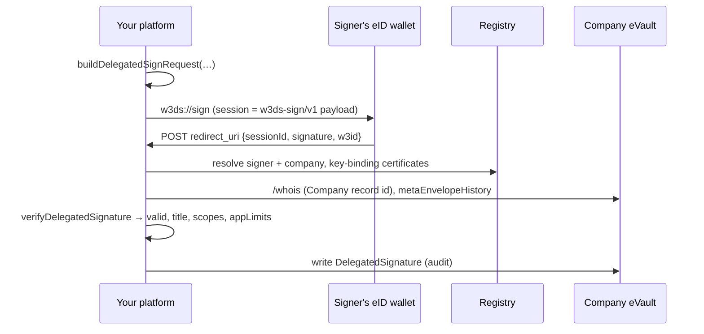

# Signing for a Company

How a platform lets someone sign **for a company** and checks they're allowed to. Read [Company Delegation](/docs/W3DS%20Protocol/Company-Delegation) first for the model: directors, roles, delegations and how a chain is traced.

Everything here is in `@metastate-foundation/auth`. You need no eID wallet changes and no eVault changes.



## 1. Ask for the signature

```ts
import { buildDelegatedSignRequest } from "@metastate-foundation/auth";

const { uri, payload } = buildDelegatedSignRequest({
    onBehalfOf: companyEName,              // the company
    signer: userEName,                     // who signs
    scope: "@esigner:nda",                 // what they sign, as a scope
    delegationId,                          // the Delegation they rely on
    documentHash: sha256Hex(fileBytes),    // what exactly is signed
    session: crypto.randomUUID(),          // your own session id
    redirectUri: `${apiBase}/api/company-signing/callback`,
    title: "Head of Finance",              // shown in the wallet
    companyName: "Acme Ltd",
});
// Show `uri` as a QR code or deep link. Keep `payload`: it is the session.
```

The wallet shows "Signing as Head of Finance for Acme Ltd" and signs `payload` exactly as it signs any session. eNames are normalised to their `@` form for you.

**Which `delegationId`?** Delegations live in the company's eVault. A user can hold several; let them pick, or choose the one whose scopes cover your document. A Delegation's `delegateEName` is the user.

## 2. Verify it in the callback

The wallet POSTs `{ sessionId, signature, w3id, message }` to `redirect_uri`. `sessionId` is the payload.

```ts
import { verifyDelegatedSignature } from "@metastate-foundation/auth";

const result = await verifyDelegatedSignature({
    payload: body.sessionId,
    signature: body.signature,
    registryBaseUrl: process.env.PUBLIC_REGISTRY_URL!,
    platformToken,               // your platform token, to read the company eVault
});

if (!result.valid) {
    // result.error: invalid_payload | bad_signature | not_covered | chain_invalid
    //               | not_a_company | resolve_failed | history_failed | timeout
    // result.detail: the precise reason, e.g. "REVOKED", "SCOPE_NOT_DELEGATED"
    return reject(result);
}

result.companyEName; // the company it was signed for
result.title;        // the signer's title, e.g. "NDA signer"
result.scopes;       // everything this delegation covers
result.chain;        // delegation ids, signer first, up to the role assignment
result.appLimits;    // every link's app limits, root first
result.payload;      // the parsed w3ds-sign/v1 fields (documentHash, session, …)
```

It never throws. Check that `result.payload.session` and `documentHash` match what you issued.

**Retry or refuse?**

- `resolve_failed`, `history_failed` and `timeout` mean the Registry or an eVault was unreachable, including while checking a grant further up the chain. Retry these.
- Everything else means the signature is not good for this company. Refuse it.

### App limits

`appLimits` is a list of objects, one per link that set any, root first. The model doesn't interpret them. **Your platform must satisfy every one**, which is how a child can never loosen what a parent set:

```ts
const maxAmount = Math.min(...result.appLimits.map((l) => Number(l.maxAmount ?? Infinity)));
if (invoice.amount > maxAmount) return reject("over the delegated amount");
```

## 3. Record it

After accepting, write a **DelegatedSignature** record into the company's eVault, for the company's audit trail:

```ts
await evault.createMetaEnvelope(companyEName, {
    ontology: DELEGATED_SIGNATURE_ONTOLOGY,   // from @metastate-foundation/delegation
    acl: ["*"],
    payload: {
        companyEName: result.companyEName,
        signerEName: result.payload.signer,
        delegationId: result.payload.delegationId,
        title: result.title,
        scope: result.payload.scope,
        documentHash: result.payload.documentHash,
        session: result.payload.session,
        signedPayload: body.sessionId,
        signature: body.signature,
        platformEName: yourPlatformEName,
        signedAt: new Date().toISOString(),
        createdAt: new Date().toISOString(),
    },
});
```

## Granting: tools that manage a company

A tool that creates companies, roles and delegations writes records that carry their grantor's signature. Use `buildGrantSignRequest`, and **pick the record id first**, because the signature is bound to it:

```ts
import { buildGrantSignRequest } from "@metastate-foundation/auth";

const recordId = `@${crypto.randomUUID()}`;
const record = {
    companyEName, delegateEName: bobEName, roleId, title: "Head of Finance",
    scopes: ["@esigner:nda"], mayRedelegate: true, grantedBy: danaEName,
    status: "active", createdAt: now, updatedAt: now,
};
const request = await buildGrantSignRequest({
    ontology: DELEGATION_ONTOLOGY, companyEName, recordId,
    signerEName: danaEName, record,
    redirectUri: `${apiBase}/api/grant/callback`,
    message: "Make Bob Head of Finance (NDAs)",
});
// …the wallet signs request.uri and POSTs back { signature }…
await evault.updateMetaEnvelope(companyEName, recordId, {     // creates it under recordId
    ontology: DELEGATION_ONTOLOGY,
    acl: ["*"],
    payload: {
        ...record,
        authorization: {
            signerEName: request.signerEName,
            signedPayload: request.payload,
            signature,
            signedAt: request.signedAt,
        },
    },
});
```

Rules your tool should follow (verifiers ignore records that break them):

- **Company:** the first version must already list `directors`, signed by one of them. Later changes must be signed by a sitting director.
- **Role:** signed by a director, and `createdBy` must be that director.
- **Delegation from a role:** signed by a director, with `grantedBy` set to that director and scopes inside the role's.
- **Re-delegation:** signed by the parent's delegate, the parent must allow re-delegation, and scopes must be inside the parent's.
- **Revoking:** write a new signed version with `status: "revoked"` and `revokedBy` set to the signer (a director, or a grantor who hasn't been revoked). By default this stops only that person: what they granted before stays valid. Set `revocationCascade: true` to also revoke everything handed on from them. Narrowing a delegation or role always narrows everything below it.
- **Use only `"active"` and `"revoked"` as statuses, and a real boolean for `revocationCascade`.** Verifiers fail closed on anything else: a malformed cascade flag counts as a cascade.
- **Never delete** these records. Deletion doesn't revoke anything, because verifiers read history.

## Logins

`verifyLoginSignature` refuses any session starting with `w3ds-`. If your platform verifies logins some other way, refuse those sessions too. A login session should always be the UUID you issued, never a payload someone else supplied.

## Try it

`examples/company-delegation-demo` runs all of this on the local stack (`pnpm dev:core`), with in-process wallets, as a slide-by-slide story. It covers:

- a chain Dana → Bob → Dave → Tim,
- traced signatures,
- a scope that isn't covered,
- an illegal re-delegation,
- a forged board,
- a login replay,
- a revocation.
