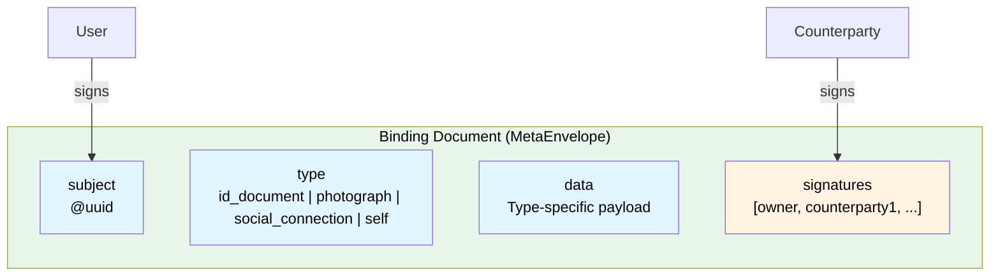
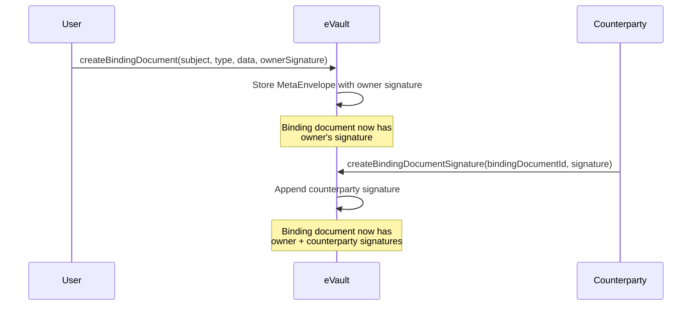

# Binding Documents

**Binding documents** are a special type of [MetaEnvelope](/docs/W3DS%20Basics/glossary#metaenvelope) that tie a user to their [eName](/docs/W3DS%20Basics/eName). They establish the relationship between a person's identity and their globally unique identifier in the W3DS ecosystem.

## Overview

A binding document always contains:
- The **subject** — the eName being bound (prefixed with `@`)
- The **type** of binding — what kind of verification or claim this represents
- **Data** — type-specific payload containing verification details
- **Signatures** — cryptographic proofs from the user and optionally from counterparty verifiers



## Binding Document Types

### id_document

Binds an eName to a verified identity document (e.g., passport, driver's license).

```json
{
  "type": "id_document",
  "data": {
    "vendor": "onfido",
    "reference": "ref-12345",
    "name": "John Doe"
  }
}
```

**Data fields:**
- `vendor` — The verification vendor used
- `reference` — Vendor's reference ID for the verification
- `name` — The name verified against the ID document

### photograph

Binds an eName to a photograph (selfie or profile picture).

```json
{
  "type": "photograph",
  "data": {
    "photoBlob": "base64encodedimage=="
  }
}
```

**Data fields:**
- `photoBlob` — Base64-encoded photograph data

### social_connection

Binds an eName to a social connection or relationship claim.

```json
{
  "type": "social_connection",
  "data": {
    "name": "Alice Smith"
  }
}
```

**Data fields:**
- `name` — Name of the connected person or entity

### self

A self-signed binding document where the user declares their identity.

```json
{
  "type": "self",
  "data": {
    "name": "Bob Jones"
  }
}
```

**Data fields:**
- `name` — Self-declared name

## Signatures

Every binding document must include at least the **owner's signature**. Counterparty signatures can be added to create multi-party verification chains.

```typescript
interface BindingDocumentSignature {
  signer: string;      // eName or keyID of who signed
  signature: string;   // Cryptographic signature
  timestamp: string;   // ISO 8601 timestamp
}
```

### Signature Flow



## Storage

Binding documents are stored as **MetaEnvelopes** in eVault:

- **Ontology ID**: `b1d0a8c3-4e5f-6789-0abc-def012345678` (defined in `/services/ontology/schemas/binding-document.json`)
- **ID**: The MetaEnvelope ID serves as the binding document ID
- **ACL**: Restricted to the subject's eName

This means:
- Each binding document is a MetaEnvelope
- The MetaEnvelope ID is used to reference the binding document
- Access is controlled by the subject's eName in the ACL

## GraphQL API

eVault provides dedicated GraphQL operations for binding documents:

### Queries

```graphql
# Get a single binding document by ID
query {
  bindingDocument(id: "meta-envelope-id") {
    subject
    type
    data
    signatures {
      signer
      signature
      timestamp
    }
  }
}

# List binding documents with optional type filter
query {
  bindingDocuments(type: id_document, first: 10) {
    edges {
      node {
        subject
        type
        data
        signatures {
          signer
          signature
          timestamp
        }
      }
    }
  }
}
```

### Mutations

```graphql
# Create a new binding document
mutation {
  createBindingDocument(input: {
    subject: "@e4d909c2-5d2f-4a7d-9473-b34b6c0f1a5a"
    type: id_document
    data: {
      vendor: "onfido"
      reference: "ref-12345"
      name: "John Doe"
    }
    ownerSignature: {
      signer: "@e4d909c2-5d2f-4a7d-9473-b34b6c0f1a5a"
      signature: "sig_abc123..."
      timestamp: "2025-01-24T10:00:00Z"
    }
  }) {
    metaEnvelopeId
    bindingDocument {
      subject
      type
      signatures {
        signer
        timestamp
      }
    }
    errors {
      message
      code
    }
  }
}

# Add a signature to an existing binding document
mutation {
  createBindingDocumentSignature(input: {
    bindingDocumentId: "meta-envelope-id"
    signature: {
      signer: "@counterparty-uuid"
      signature: "sig_counterparty_xyz..."
      timestamp: "2025-01-24T11:00:00Z"
    }
  }) {
    bindingDocument {
      signatures {
        signer
        signature
        timestamp
      }
    }
    errors {
      message
      code
    }
  }
}
```

## Related

- [eName](/docs/W3DS%20Basics/eName) — The identifier that binding documents tie users to
- [W3ID](/docs/W3DS%20Basics/W3ID) — The broader identifier system
- [eVault](/docs/Infrastructure/eVault) — Where binding documents are stored
- [Ontology](/docs/Infrastructure/Ontology) — Schema definitions including binding-document schema
