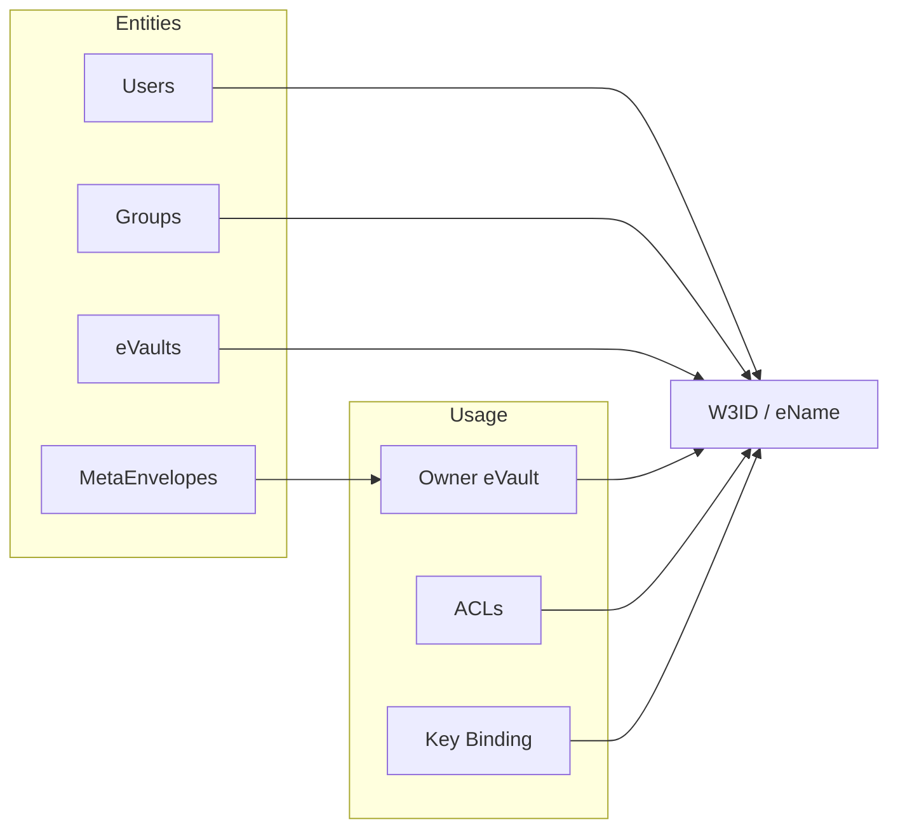

# W3ID

W3ID (Web 3 Identifier) is the main identifier for the whole W3DS ecosystem. W3IDs are UUID-based, persistent, and globally unique. When the term **eName** is used, it means a universally resolvable W3ID—one that can be resolved via the Registry to an eVault (or service) endpoint.

## Overview

In W3DS, every user, group, eVault, and many objects are identified by a **W3ID**. The same identifier is used across platforms, eVaults, and the Registry. An **eName** is a W3ID that is registered in the Registry and can therefore be resolved to a concrete service URL (e.g. an eVault). So: **eName = W3ID + registered in the Registry**.

### Key Concepts

- **W3ID**: The primary identifier for entities in the ecosystem; UUID-based (see [RFC 4122](https://datatracker.ietf.org/doc/html/rfc4122)).
- **eName**: A **universally resolvable** W3ID. Resolving an eName via the Registry yields the eVault (or controller) URL for that identity.
- **Global vs local**: Global IDs (e.g. `@e4d909c2-5d2f-4a7d-9473-b34b6c0f1a5a`) are the primary persistent identity. Local IDs (e.g. `@e4d909c2-5d2f-4a7d-9473-b34b6c0f1a5a/f2a6743e-8d5b-43bc-a9f0-1c7a3b9e90d7`) refer to an object *within* an eVault: the part after the slash is the object UUID in the context of the eVault identified by the part before the slash.

## W3ID Format

The W3ID URI format is:

- **Global**: `@<UUID in HEX>` (case insensitive). The number and positioning of dashes follow RFC 4122. Example: `@e4d909c2-5d2f-4a7d-9473-b34b6c0f1a5a`
- **Local**: `@<eVault-UUID>/<object-UUID>` — the object `object-UUID` at the eVault (or owner) `eVault-UUID`. Example: `@e4d909c2-5d2f-4a7d-9473-b34b6c0f1a5a/f2a6743e-8d5b-43bc-a9f0-1c7a3b9e90d7`

The UUID namespace has range 2^122, which is far larger than the expected number of identities (e.g. 10^22), so collision risk is negligible.

## Registry Resolution (eName)

What makes a W3ID an **eName** is that it is registered in the Registry and can be resolved to a service URL:

1. A client sends `GET /resolve?w3id=@e4d909c2-5d2f-4a7d-9473-b34b6c0f1a5a` to the Registry.
2. The Registry returns the eVault (or controller) URL for that W3ID.
3. The client can then call that URL (e.g. `/graphql`, `/whois`) with the eName in the `X-ENAME` header.

So **eName** means: a W3ID that is universally resolvable via the Registry. Users and groups typically have eNames; internal or local-only identifiers may be W3IDs that are not registered and thus not eNames.

## Where W3IDs Appear

- **Users and groups**: Each has a persistent W3ID (typically an eName). For a person, the W3ID is the long-lived anchor that connects keys (eID certificate, PKI) and the physical person (body characteristics, passport, friends).
- **eVaults**: An eVault may have its own internal W3ID used for syncing between clones or by the hosting provider; the user’s eName is what identifies the “owner” of the vault.
- **MetaEnvelopes**: Each envelope has an owner (a W3ID/eName) and an optional global ID; the W3ID URI scheme can be used to refer to an envelope (e.g. `@<owner-uuid>/<envelope-uuid>`).
- **ACLs**: Access control lists reference W3IDs (eNames) to indicate who can access data.
- **Key binding**: Public keys in the eVault are bound to the user’s W3ID (eName) via key binding certificates.

## Key Binding and Recovery

The identifier is **loosely bound** to a set of keys: the W3ID is not derived from the keys. That allows:

- **Key rotation**: Keys can be changed (e.g. after compromise or device loss) without changing the W3ID.
- **Friend-based recovery**: A trust list (e.g. 2–3 friends or notaries) can verify identity and approve key changes. The user defines this list while they still have access to their keys.
- **eVault migration**: When a user migrates from one eVault to another, the Registry can store also-known-as (redirect) records so that resolution of the same eName continues to work (e.g. requests for the old eVault W3ID are redirected to the new eVault).

## Document Binding

The identifier can be loosely bound to a passport via a binding document certified by a root CA, where the identifier is connected to entropy derived from passport details. Passport verification itself is out of scope for W3ID and is handled by the eID Wallet application.

## Technical Requirements and Guarantees

- The identifier must be **globally persistent** and **unique**.
- The identifier must live in a namespace with range greater than 10^22.
- The identifier must support **rotation of secrets** and must be only **loosely bound** to keys.
- The identifier may be loosely tied to a binding document (e.g. passport).

## Implementation

The W3ID system is implemented in the `w3id` package (TypeScript) and provides:

- **W3IDBuilder**: Builder pattern for creating W3IDs (with entropy, namespace, global/local, signer, repository, next-key hash).
- **ID log manager**: Immutable, signed event logs for key rotation and identity updates.
- **JWT signing**: A W3ID with a signer can sign JWTs (e.g. for authentication or key binding certificates).

This package is useful to create W3IDs with keys or make them global, it is
consumed currently by [eID Wallet](/docs/Infrastructure/eID-Wallet) and [Web3 Adapter](/docs/Infrastructure/Web3-Adapter)

For implementation details (builder API, storage backends, logging format), see the `w3id` package in the repository.
