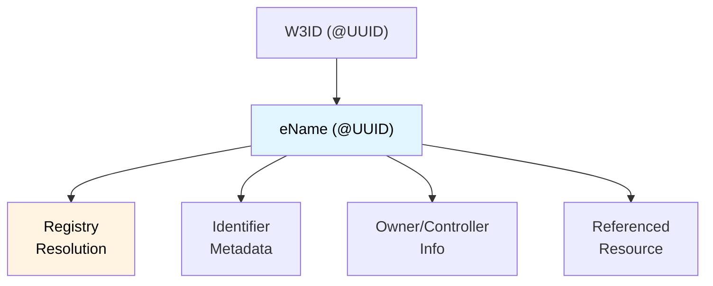

# eName

An **eName** is a globally unique identifier that is a subset of [W3ID](/docs/W3DS%20Basics/W3ID). It is registered in the [Registry](/docs/Infrastructure/Registry) and can be resolved to access information about the identifier, its owner/controller, and the resources it references.

## Overview

While all W3IDs are UUID-based and globally unique, an **eName** is specifically registered in the Registry, making it resolvable to a service endpoint (typically an eVault). This resolution allows:

- **Information about the identifier itself** — metadata such as when it was created, its type, and current status
- **Information about the owner/controller** — who controls the eName, their public keys, and verification credentials
- **The resource it references** — the actual data or service (e.g., an eVault) associated with the eName

## eName Characteristics



### Key Characteristics

- **Globally Unique**: eNames use UUID v5 namespaces, ensuring uniqueness across the entire ecosystem
- **Universally Resolvable**: Through the Registry, any eName can be resolved to its service endpoint
- **Owner-Bound**: Each eName is associated with an owner (person, organization, or entity) who controls it
- **Key-Bound**: eNames can be bound to cryptographic public keys for signing and authentication
- **Persistent**: Once registered, an eName remains valid (subject to Registry policies)

## eName vs W3ID

| Aspect | W3ID  | eName |
|--------|----------------|-------|
| Format | `@<UUID>` | `@<UUID>` |
| Globally unique via Registry | No | Yes |
| Resolvable to service | No | Yes |
| Used in X-ENAME header | No | Yes (primary use) |

## Usage in eVault

Every eVault is identified by an eName. When making API calls to eVault, the `X-ENAME` header must contain the eName of the vault owner:

```http
X-ENAME: @e4d909c2-5d2f-4a7d-9473-b34b6c0f1a5a
```

The eName is used for:
- **Access Control**: Determining which vault data can be accessed
- **Data Isolation**: Ensuring users can only access their own data
- **Resolution**: Mapping the eName to the correct eVault service endpoint

## Related

- [W3ID](/docs/W3DS%20Basics/W3ID) — The full identifier system
- [Binding Documents](/docs/W3DS%20Basics/Binding-Documents) — Documents that tie users to their eNames
- [Registry](/docs/Infrastructure/Registry) — Service for resolving eNames
- [eVault](/docs/Infrastructure/eVault) — The storage system identified by eNames
