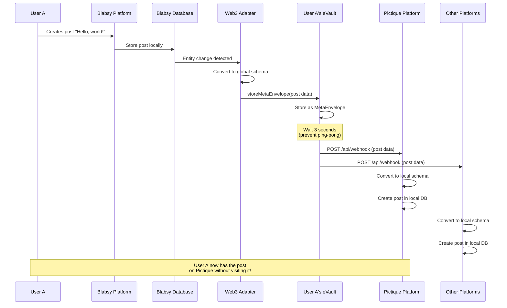
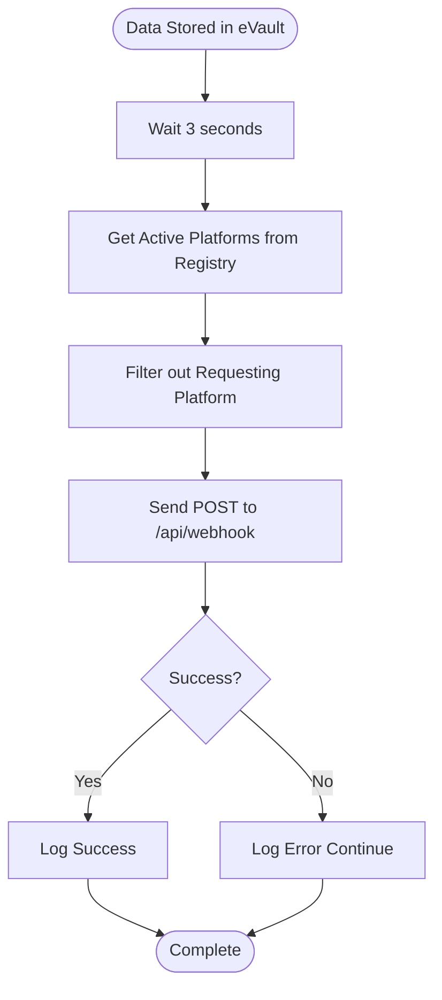

# W3DS Basics

This document provides a deep dive into the core concepts of W3DS (Web 3 Data Spaces), including eVault ownership, data synchronization, and the webhook notification system.

## eVault Ownership Model

In W3DS, **every user, group, and object owns their own eVault**. This is the fundamental principle that enables data portability and platform independence.

### What is an eVault?

An **eVault** is a personal data store identified by a **W3ID** (also called an **eName**). It's where all data about a person, group, or object is stored in a standardized format called **MetaEnvelopes**.

### Ownership Structure

- **Users**: Each user has their own eVault (e.g., `@user-a.w3id`)
- **Groups**: Each group has its own eVault (e.g., `@group-1.w3id`)
- **Objects**: Important objects can have their own eVaults

### Key Characteristics

1. **Persistent Identity**: The W3ID (eName) never changes, even if the eVault URL changes
2. **User Control**: Users control access to their eVault via ACLs (Access Control Lists)
3. **Platform Agnostic**: Platforms don't own the data - they only display it
4. **Decentralized**: Each eVault can be hosted independently

## Data Flow: Platform → eVault → All Platforms

The W3DS data flow ensures that data created on one platform automatically appears on all other platforms. Here's how it works:

### Step-by-Step Flow

Let's trace what happens when **User A creates a post on Blabsy**:



### Detailed Breakdown

#### 1. User Creates Post on Blabsy

User A opens Blabsy and creates a post with the text "Hello, world!". Blabsy stores this in its local PostgreSQL database.

#### 2. Web3 Adapter Detects Change

The platform needs to detect when data changes in its local database. This can be implemented using:

- **Database triggers**: Set up triggers that fire on INSERT/UPDATE/DELETE operations
- **ORM event listeners**: If using an ORM, hook into entity lifecycle events (afterInsert, afterUpdate, etc.)
- **Change data capture (CDC)**: Monitor database transaction logs
- **Application-level hooks**: Call the adapter directly after database operations

The adapter must receive:
- The changed entity data (as a dictionary/object)
- The table name or entity type
- Optionally, a list of participant eNames if the entity involves multiple users

When a post is created, the platform should extract all relevant fields from the database record and pass them to the adapter's change handler along with the table name "posts".

#### 3. Convert to Global Schema

The Web3 Adapter converts the local post data to the global ontology schema. For example:

- Local: `{ text: "Hello, world!", images: [...] }`
- Global: `{ content: "Hello, world!", mediaUrls: [...] }`

This conversion uses mapping rules defined in `mapping.json` files.

#### 4. Sync to User's eVault

The adapter makes an HTTP POST request to the eVault's GraphQL endpoint. The request must include:

**HTTP Request Details**:
- **Method**: POST
- **URL**: `{evaultUrl}/graphql` (where evaultUrl is resolved from the user's eName via Registry)
- **Headers**: 
  - `Content-Type: application/json`
  - `X-ENAME: @user-a.w3id` (the owner's eName)
- **Body**: GraphQL mutation

**GraphQL Mutation**:
```graphql
mutation StoreMetaEnvelope($input: MetaEnvelopeInput!) {
  storeMetaEnvelope(input: $input) {
    metaEnvelope {
      id
      ontology
      parsed
    }
  }
}
```

**Variables**:
```json
{
  "input": {
    "ontology": "550e8400-e29b-41d4-a716-446655440001",
    "payload": {
      "content": "Hello, world!",
      "mediaUrls": [],
      "authorId": "...",
      "createdAt": "2025-01-24T10:00:00Z"
    },
    "acl": ["*"]
  }
}
```

**Response**: The eVault returns the created MetaEnvelope with a global ID that should be stored for future reference.

**Implementation Notes**:
- Use any HTTP client library in your language (requests in Python, http in Go, fetch in JavaScript, etc.)
- The GraphQL request is a standard HTTP POST with JSON body
- The X-ENAME header identifies which eVault to write to
- Handle network errors and retry logic as needed

#### 5. eVault Stores MetaEnvelope

The eVault stores the data as a MetaEnvelope, which is a flat graph structure of Envelopes. Each field becomes a separate Envelope node in Neo4j.

#### 6. Webhook Delivery (After 3 Second Delay)

After a 3-second delay (to prevent webhook ping-pong), the eVault sends webhooks to all registered platforms **except** the one that made the request (Blabsy).

The webhook payload contains:
```json
{
    "id": "global-id-123",
    "w3id": "@user-a.w3id",
    "schemaId": "550e8400-e29b-41d4-a716-446655440001",
    "data": {
        "content": "Hello, world!",
        "mediaUrls": [],
        "authorId": "...",
        "createdAt": "2025-01-24T10:00:00Z"
    }
}
```

#### 7. Platforms Receive Webhooks

Pictique and other platforms receive the webhook at their `/api/webhook` endpoint. The platform must implement an HTTP POST handler that:

1. **Parse the webhook payload**: Extract `id`, `w3id`, `schemaId`, and `data` from the JSON request body

2. **Find the mapping**: Look up the mapping configuration using the `schemaId`. The mapping defines how to convert between global ontology fields and local database fields.

3. **Convert from global to local schema**: Transform the data using the mapping rules:
   - Map field names (e.g., `content` → `text`, `mediaUrls` → `images`)
   - Handle nested references (e.g., `authorId` might need to resolve to a local user ID)
   - Convert data types if needed
   - Handle array transformations

4. **Check if entity exists**: Query the ID mapping table/database to see if a local entity already exists for this global ID. The mapping stores pairs of `(globalId, localId)`.

5. **Create or update entity**:
   - If mapping exists: Update the existing local entity with the new data
   - If no mapping: Create a new entity in the local database and store the mapping

6. **Store the ID mapping**: Save the relationship between the global ID and the newly created/updated local entity ID for future lookups.

7. **Return success**: Send HTTP 200 OK response to acknowledge receipt of the webhook.

**Implementation Requirements**:
- HTTP server with POST endpoint handler
- JSON parsing library
- Database access (SQL or NoSQL)
- ID mapping storage (database table, key-value store, or in-memory cache with persistence)
- Field mapping logic (can be implemented as a simple dictionary/object transformation)

#### 8. Result

User A now has the post on Pictique (and all other platforms) without ever visiting them!

## Webhook Notification System

The webhook system is how eVaults notify platforms of data changes.

### Webhook Delivery Process



### Webhook Payload Structure

Every webhook contains:

- **id**: The global ID of the MetaEnvelope
- **w3id**: The eName (W3ID) of the owner
- **schemaId**: The ontology schema ID (UUID)
- **data**: The actual data in global ontology format
- **evaultPublicKey**: The eVault's public key (for verification)

### Platform Webhook Handling

Platforms must implement a webhook endpoint that:

1. Receives the webhook payload
2. Finds the mapping using `schemaId`
3. Converts global data to local schema using `fromGlobal()`
4. Checks if entity exists using global ID mapping
5. Creates or updates the entity
6. Stores the ID mapping

See the [Webhook Controller Guide](/docs/Post%20Platform%20Guide/webhook-controller) for implementation details.

## MetaEnvelopes and Ontology Schemas

### MetaEnvelopes

A **MetaEnvelope** is the storage format in eVaults. It's a flat graph structure where:

- Each MetaEnvelope represents one entity (post, user, message, etc.)
- Each field becomes a separate Envelope node
- Envelopes are linked to the MetaEnvelope via `LINKS_TO` relationships

### Ontology Schemas

**Ontology schemas** define the global data format. They're JSON Schema files that specify:

- Field names and types
- Required fields
- Validation rules
- Schema IDs (UUIDs)

Example: `SocialMediaPost` schema defines fields like `content`, `mediaUrls`, `authorId`, etc.

All platforms must map their local schemas to these global schemas. See [Mapping Rules](/docs/Post%20Platform%20Guide/mapping-rules) for details.

## W3ID (eName) System

**W3ID** (also called **eName**) is the persistent identifier for users, groups, and objects.

### Format

- Global IDs: `@<UUID>` (e.g., `@e4d909c2-5d2f-4a7d-9473-b34b6c0f1a5a`)
- Local IDs: `@<UUID>/<UUID>` (for objects within an eVault)

### Resolution

W3IDs are resolved to eVault URLs via the Registry Service:

```
GET /resolve?w3id=@user-a.w3id
→ Returns: https://evault.example.com/users/user-a
```

### Key Properties

1. **Persistent**: Never changes, even if eVault URL changes
2. **Globally Unique**: UUID-based ensures uniqueness
3. **Loosely Bound to Keys**: Can rotate keys without changing W3ID
4. **Resolvable**: Registry maps W3ID to current eVault URL

## Data Ownership and ACLs

### Access Control Lists (ACLs)

ACLs determine who can access data in an eVault. Common patterns:

- `["*"]`: Public access (anyone can read)
- `["@user-a.w3id"]`: Only User A can access
- `["@user-a.w3id", "@user-b.w3id"]`: User A and User B can access

### Ownership Model

- **Data Creator**: The user who creates data owns it
- **eVault Owner**: The user whose eVault stores the data
- **Platform Access**: Platforms can read/write based on ACLs

## Platform Independence

One of the key benefits of W3DS is **platform independence**:

1. **No Vendor Lock-in**: Users can switch platforms without losing data
2. **Multi-Platform Presence**: Data automatically appears on all platforms
3. **Platform Competition**: Platforms compete on features, not data ownership
4. **User Choice**: Users choose platforms based on UX, not data availability

## Example: Complete Post Flow

Here's a complete example showing all components working together:

```mermaid
graph LR
    subgraph UserA["User A"]
        A1[Creates Post]
    end

    subgraph Blabsy["Blabsy Platform"]
        B1[Local DB]
        B2[Web3 Adapter]
    end

    subgraph EVault["User A's eVault"]
        E1[Store MetaEnvelope]
        E2[Webhook System]
    end

    subgraph Pictique["Pictique Platform"]
        P1[Webhook Handler]
        P2[Local DB]
    end

    A1 -->|1. Create| B1
    B1 -->|2. Change Event| B2
    B2 -->|3. Convert Schema| E1
    E1 -->|4. Store| E2
    E2 -->|5. Webhook| P1
    P1 -->|6. Convert & Store| P2

    style A1 fill:#e1f5ff,color:#000000
    style E1 fill:#fff4e1,color:#000000
    style P2 fill:#e8f5e9,color:#000000
```



## Next Steps

- Learn about [Authentication](/docs/W3DS%20Protocol/Authentication) - How users authenticate
- Understand [Signing](/docs/W3DS%20Protocol/Signing) - Signature creation and verification
- Explore [Signature Formats](/docs/W3DS%20Protocol/Signature-Formats) - Cryptographic details
- Build a platform with the [Post Platform Guide](/docs/Post%20Platform%20Guide/getting-started)
