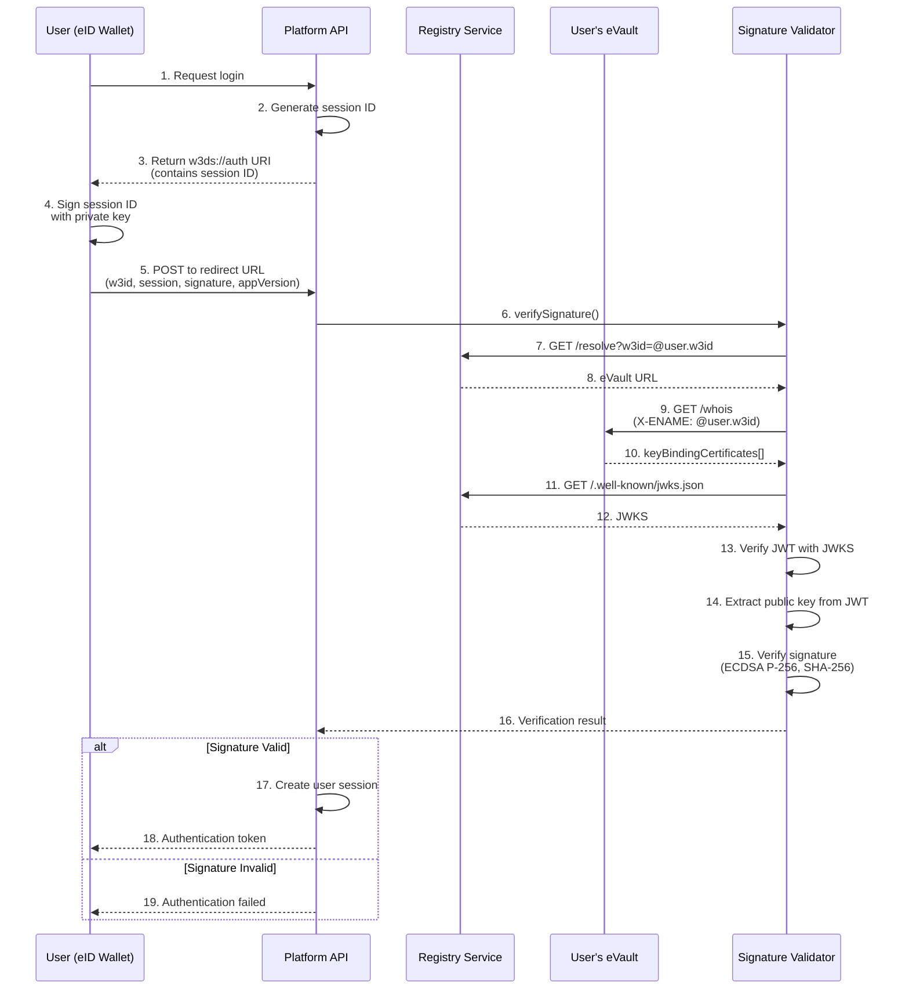

# Authentication

W3DS uses cryptographic signature-based authentication. Users authenticate with platforms by signing a session ID with their private key, which platforms verify using public keys stored in eVaults.

## Overview

Unlike traditional password-based authentication, W3DS uses **cryptographic signatures** for authentication. This provides:

- **No passwords**: Users never share secrets with platforms
- **Cryptographic proof**: Platforms can cryptographically verify user identity
- **Key-based**: Uses ECDSA P-256 keys managed by the eID wallet
- **Decentralized**: Public keys stored in user's eVault, verified via Registry

## Authentication Flow

The authentication process follows these steps:



## Protocol Steps

### Step 1: Platform Requests Session

When a user wants to log in, the platform must:

1. **Generate a unique session identifier**: Use a cryptographically secure random UUID (version 4). This session ID will be signed by the user, so it must be unique and unpredictable.

2. **Construct the redirect URL**: Build the full URL where the eID wallet will POST the signed session data. This is typically `{platformBaseUrl}/api/auth/login` or similar. The wallet will make an HTTP POST request to this URL with the signed authentication data.

3. **Build the w3ds://auth URI**: Create a URI with the following format:
   ```text
   w3ds://auth?redirect={redirectUrl}&session={sessionId}&platform={platformName}
   ```
   - `redirect`: URL-encoded redirect endpoint where the eID wallet will POST the signed session (this is the callback URL)
   - `session`: The generated session UUID
   - `platform`: Platform identifier (for display purposes)

4. **Return JSON response**: Send a JSON object with the `uri` field containing the w3ds://auth URI.

**HTTP Endpoint**: `GET /api/auth/offer`

**Request**: No body required, standard HTTP GET

**Response Format**:
```json
{
    "uri": "w3ds://auth?redirect=https://blabsy.example.com/api/auth&session=550e8400-e29b-41d4-a716-446655440000&platform=blabsy"
}
```

**Implementation Requirements**:
- Generate UUID v4 (128-bit random UUID)
- URL-encode the redirect parameter
- Return JSON with Content-Type: application/json
- Store the session ID temporarily (in memory, cache, or database) to validate it later

**Reference Implementation** (TypeScript):
```typescript
getOffer = async (req: Request, res: Response) => {
    const url = new URL(
        "/api/auth",
        process.env.PUBLIC_BLABSY_BASE_URL
    ).toString();
    const session = uuidv4();
    const offer = `w3ds://auth?redirect=${url}&session=${session}&platform=blabsy`;
    res.json({ uri: offer });
};
```

### Step 2: User Signs Session ID

The user's eID wallet signs the session ID using their private key. The signing process:

1. **Parse the w3ds://auth URI**: Extract the `session` parameter from the query string. The session ID is a UUID string that must be signed exactly as received.

2. **Hash the session ID**: Convert the session ID string to bytes using UTF-8 encoding, then compute SHA-256 hash. This produces a 32-byte hash digest.

3. **Sign the hash**: Use ECDSA P-256 (secp256r1 curve) to sign the hash with the user's private key:
   - **Algorithm**: ECDSA
   - **Curve**: P-256 (secp256r1, NIST P-256)
   - **Hash**: SHA-256
   - **Result**: A signature consisting of two 32-byte integers (r and s), concatenated to form a 64-byte raw signature

4. **Encode the signature**: 
   - **Software keys**: Encode the 64-byte signature using base64 encoding
   - **Hardware keys**: Encode using multibase base58btc (starts with 'z' prefix)

**Cryptographic Details**:
- **Curve**: secp256r1 (NIST P-256)
- **Hash Algorithm**: SHA-256
- **Signature Format**: Raw 64-byte (r || s), where r and s are each 32 bytes
- **Encoding**: Base64 (software) or Multibase base58btc (hardware)

**Library Requirements** (for wallet implementation):
- ECDSA signing library (crypto libraries in most languages support this)
- SHA-256 hashing
- Base64 or base58btc encoding
- Key management for storing/accessing private keys securely

For detailed signature format information, see the [Signature Formats documentation](/docs/W3DS%20Protocol/Signature-Formats).

### Step 3: eID Wallet POSTs Signed Session

After the user signs the session ID, the eID wallet makes an HTTP POST request to the `redirect` URL specified in the `w3ds://auth` URI. The platform receives this POST request with the signed session data:

**Endpoint**: The `redirect` URL from the `w3ds://auth` URI (e.g., `POST /api/auth/login`)

**What the eID Wallet POSTs**:

**Request Headers**:
- `Content-Type: application/json`

**Request Body** (JSON):
```json
{
    "w3id": "@user-a.w3id",
    "session": "550e8400-e29b-41d4-a716-446655440000",
    "signature": "xK3vJZQ2F3k5L8mN9pQrS7tUvW1xY3zA5bC7dE9fG1hIjKlMnOpQrStUvWxYz==",
    "appVersion": "0.4.0"
}
```

**Field Descriptions**:
- `w3id`: The user's W3ID (eName) identifier, always starts with '@'
- `session`: The session UUID that was generated in Step 1
- `signature`: The base64 or multibase-encoded signature of the session ID
- `appVersion`: Optional version string for compatibility checking

> **Note on `appVersion`**: This field is temporary and will be sunset after the rollout is completed. It was added because some users were on outdated eID wallet versions that handled signing differently. Once all users have updated to compatible versions, this field will be removed from the protocol.

**Platform Processing Steps**:

1. **Validate Input**: Ensure all required fields (w3id, session, signature) are present and non-empty. Return 400 Bad Request if validation fails.

2. **Validate Session**: Check that the session ID matches one that was recently generated (within the last 5 minutes). Reject duplicate or expired sessions. This prevents replay attacks.

3. **Verify Signature**: Call the signature verification function (see [Signing documentation](/docs/W3DS%20Protocol/Signing)) with:
   - The user's eName
   - The signature string
   - The session ID as the payload
   - The Registry base URL

4. **Handle Verification Result**: 
   - If verification succeeds: Create a session token (JWT, session cookie, or platform-specific token) and return it
   - If verification fails: Return 401 Unauthorized with an error message

5. **Optional App Version Check**: Validate that appVersion meets minimum requirements. Return 400 if version is too old. Note: This check is temporary and will be removed after the rollout is completed (see note on `appVersion` field above).

**Response on Success** (200 OK):
```json
{
    "token": "eyJhbGciOiJIUzI1NiIsInR5cCI6IkpXVCJ9..."
}
```

**Response on Failure** (401 Unauthorized):
```json
{
    "error": "Invalid signature",
    "message": "Signature verification failed"
}
```

**Reference Implementation** (TypeScript):
```typescript
login = async (req: Request, res: Response) => {
    const { w3id, session, appVersion, signature } = req.body;

    if (!w3id || !session || !signature) {
        return res.status(400).json({ error: "Missing required fields" });
    }

    // Verify signature (see Signing documentation)
    const verificationResult = await verifySignature({
        eName: w3id,
        signature: signature,
        payload: session,
        registryBaseUrl: process.env.PUBLIC_REGISTRY_URL,
    });

    if (!verificationResult.valid) {
        return res.status(401).json({ 
            error: "Invalid signature", 
            message: verificationResult.error 
        });
    }

    // Create authentication token
    const token = await auth().createCustomToken(w3id);
    res.status(200).json({ token });
};
```

## Platform Implementation

### Example: Blabsy Auth Controller

**Version Validation Helper Function**:

Before implementing the auth controller, you'll need a function to compare semantic versions. Here's an implementation example:

```typescript
/**
 * Compares two semantic version strings (e.g., "1.2.3")
 * @param appVersion - The version to check (e.g., "0.3.5")
 * @param minVersion - The minimum required version (e.g., "0.4.0")
 * @returns true if appVersion >= minVersion, false otherwise
 */
function isVersionValid(appVersion: string | undefined, minVersion: string): boolean {
    if (!appVersion) {
        return false; // Missing version is considered invalid
    }

    // Parse versions into [major, minor, patch] arrays
    const parseVersion = (version: string): number[] => {
        return version.split('.').map(Number).slice(0, 3);
    };

    const app = parseVersion(appVersion);
    const min = parseVersion(minVersion);

    // Compare lexicographically: major, then minor, then patch
    for (let i = 0; i < 3; i++) {
        if (app[i] > min[i]) {
            return true; // appVersion is newer
        }
        if (app[i] < min[i]) {
            return false; // appVersion is older
        }
        // Continue to next component if equal
    }

    return true; // Versions are equal
}
```

**Language-Agnostic Implementation**:

The version comparison logic can be implemented in any language:

1. **Parse versions**: Split version strings by '.' into arrays of integers (major, minor, patch)
2. **Compare components**: Compare major, then minor, then patch lexicographically
3. **Return result**: Return `true` if appVersion >= minVersion, `false` otherwise

**Library Alternatives**:
- **Node.js/TypeScript**: Use `semver` package: `semver.gte(appVersion, minVersion)`
- **Python**: Use `packaging.version`: `Version(appVersion) >= Version(minVersion)`
- **Go**: Use `golang.org/x/mod/semver`: `semver.Compare(appVersion, "v"+minVersion) >= 0`
- **Java**: Use `org.apache.maven.artifact.versioning.ComparableVersion`

```typescript
import { Request, Response } from "express";
import { v4 as uuidv4 } from "uuid";
import { verifySignature } from "signature-validator";

export class AuthController {
    // Step 1: Generate session and return w3ds://auth URI
    getOffer = async (req: Request, res: Response) => {
        const url = new URL(
            "/api/auth",
            process.env.PUBLIC_BLABSY_BASE_URL
        ).toString();
        const session = uuidv4();
        const offer = `w3ds://auth?redirect=${url}&session=${session}&platform=blabsy`;
        res.json({ uri: offer });
    };

    // Step 2: Verify signature and authenticate
    login = async (req: Request, res: Response) => {
        const { w3id, session, signature, appVersion } = req.body;

        // Validate input
        if (!w3id || !session || !signature) {
            return res.status(400).json({ error: "Missing required fields" });
        }

        // Verify app version
        if (!isVersionValid(appVersion, "0.4.0")) {
            return res.status(400).json({ 
                error: "App version too old" 
            });
        }

        // Verify signature
        const verificationResult = await verifySignature({
            eName: w3id,
            signature: signature,
            payload: session,
            registryBaseUrl: process.env.PUBLIC_REGISTRY_URL,
        });

        if (!verificationResult.valid) {
            return res.status(401).json({ 
                error: "Invalid signature", 
                message: verificationResult.error 
            });
        }

        // Create authentication token
        const token = await auth().createCustomToken(w3id);
        res.status(200).json({ token });
    };
}
```

### Example: Pictique Auth Controller

```typescript
import { verifySignature } from "signature-validator";
import { signToken } from "../utils/jwt";

export class AuthController {
    login = async (req: Request, res: Response) => {
        const { w3id, session, signature } = req.body;

        // Verify signature
        const verificationResult = await verifySignature({
            eName: w3id,
            signature: signature,
            payload: session,
            registryBaseUrl: process.env.PUBLIC_REGISTRY_URL,
        });

        if (!verificationResult.valid) {
            return res.status(401).json({ 
                error: "Invalid signature" 
            });
        }

        // Find or create user
        let user = await this.userService.findByEname(w3id);
        if (!user) {
            throw new Error("User not found");
        }

        // Generate JWT token
        const token = signToken({ userId: user.id });

        res.status(200).json({
            user: {
                id: user.id,
                ename: user.ename,
            },
            token,
        });
    };
}
```

## Security Considerations

### 1. Session ID Uniqueness

- Session IDs must be **cryptographically random** (use UUID v4)
- Each session ID should be used **only once**
- Expire session IDs after a reasonable time (e.g., 5 minutes)

**Why this matters**: Without these protections, an attacker who intercepts a signed session ID could reuse it to authenticate as the user. This is called a **replay attack**. If session IDs:
- Are predictable (not cryptographically random): Attackers could guess or generate valid session IDs
- Can be reused: An intercepted signed session ID could be used multiple times to gain unauthorized access
- Don't expire: An old intercepted session ID could be used indefinitely, even after the user has logged out or changed their keys

By enforcing uniqueness, one-time use, and expiration, platforms ensure that even if a signed session ID is intercepted, it cannot be used after it expires or has already been consumed, significantly reducing the window of vulnerability.

### 2. Signature Replay Prevention

- Include **nonces or timestamps** in signed payloads
- Platforms should track used session IDs
- Reject duplicate session IDs

### 3. App Version Validation

> **Note**: App version validation is temporary and will be removed after the rollout is completed. It was added because some users were on outdated eID wallet versions that handled signing differently.

- Platforms should validate app version to ensure compatibility (during the rollout period)
- Reject authentication from outdated app versions
- Provide clear error messages for version mismatches

### 4. Error Handling

- **Never expose sensitive information** in error messages
- Log verification failures for security monitoring
- Return generic errors to prevent information leakage

## Troubleshooting

### Common Issues

1. **Session validation fails**
   - Check that session IDs are stored and retrieved correctly
   - Verify session expiration logic
   - Ensure session IDs are not reused

2. **Authentication token creation fails**
   - Verify token generation library is configured correctly
   - Check that user data is available after signature verification
   - Ensure token expiration is set appropriately

3. **App version validation issues** (temporary - will be removed after rollout)
   - Verify version comparison logic
   - Check that minimum required version is correctly configured
   - Ensure version strings are parsed correctly

## References

- [Signing](/docs/W3DS%20Protocol/Signing) - Signature creation and verification details
- [Signature Formats](/docs/W3DS%20Protocol/Signature-Formats) - Detailed signature format documentation
