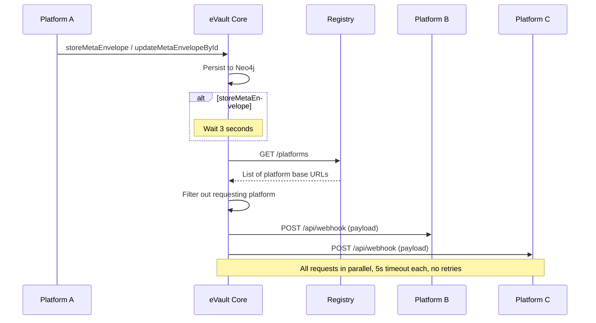

# Awareness Protocol

:::warning Prototype-level implementation
The Awareness Protocol described here is **prototype-level**. The packet format, delivery behavior, and platform contract are subject to change in upcoming updates
:::

The Awareness Protocol is the webhook deliverability mechanism in W3DS. When data in an eVault changes (create or update), the eVault notifies all other registered platforms so they can stay in sync. "Awareness" means platforms become aware of changes that happened elsewhere.

## Overview

Platforms do not poll eVaults for changes. Instead, eVault Core pushes change notifications to every registered platform (except the one that originated the change) via HTTP POST to each platform's `/api/webhook` endpoint. The payload is called an **awareness protocol packet**. Platforms use this packet to apply the same change locally (e.g. create or update an entity in their database) and to maintain ID mappings between global and local IDs.

### Key Properties

- **Push-based**: eVault initiates delivery; platforms do not poll.
- **Fire-and-forget**: The eVault does not wait for platforms to acknowledge; failures are logged but do not block the store/update operation.
- **No retries**: There are no automatic retries for failed webhook deliveries in the current implementation.
- **Requestor excluded**: The platform that made the GraphQL request (store/update) is excluded from the list of recipients to avoid "webhook ping-pong."

## When the Protocol Runs

The Awareness Protocol is triggered after:

1. **storeMetaEnvelope** (create): After the new MetaEnvelope is stored in the eVault, webhooks are **scheduled with a 3-second delay**. The delay exists because the requesting platform's URL may not be known immediately from the Bearer token; without the delay, the same platform could receive its own write back and create a feedback loop ("webhook ping-pong").
2. **updateMetaEnvelopeById** (update): After the MetaEnvelope is updated, webhooks are sent **immediately** (fire-and-forget, no delay).

## Mechanism



### Step-by-Step

1. **Platform list**: eVault calls the Registry with `GET /platforms` and receives a list of platform base URLs (e.g. `["https://blabsy.example.com", "https://pictique.example.com", ...]`).
2. **Filter**: The requesting platform is removed from the list. The requestor is identified from the Bearer token's `platform` claim (the platform URL that was certified when the token was issued). URL comparison is normalized so that equivalent URLs are treated as the same.
3. **Delivery**: For each remaining URL, the eVault sends `POST {platformUrl}/api/webhook` with the awareness protocol payload. Each request has a 5-second timeout. Requests are sent in parallel (`Promise.allSettled`); if one fails, others still run, and failures are logged without blocking the mutation.

## Packet Format (Awareness Protocol Payload)

The body of each webhook request is JSON with the following fields:

| Field | Description |
|-------|-------------|
| `id` | Global MetaEnvelope ID (UUID). |
| `w3id` | Owner eName (eVault owner W3ID). |
| `schemaId` | Ontology/schema UUID (identifies the type of entity and which mapping the platform should use). |
| `data` | The entity payload in the **global ontology** shape (parsed key-value structure). |
| `evaultPublicKey` | Optional; eVault public key. |

**Content-Type**: `application/json`

**Example**:

```json
{
  "id": "a1b2c3d4-e5f6-7890-abcd-ef1234567890",
  "w3id": "@e4d909c2-5d2f-4a7d-9473-b34b6c0f1a5a",
  "schemaId": "550e8400-e29b-41d4-a716-446655440001",
  "data": {
    "content": "Hello, world!",
    "mediaUrls": [],
    "authorId": "@e4d909c2-5d2f-4a7d-9473-b34b6c0f1a5a",
    "createdAt": "2025-01-24T10:00:00Z"
  },
  "evaultPublicKey": "z..."
}
```

## Platform Contract

Platforms that participate in W3DS must implement an HTTP endpoint that accepts awareness protocol packets:

- **Method and path**: `POST /api/webhook`
- **Request**: JSON body as described above.
- **Behavior**: The platform should (1) use `schemaId` to find the correct mapping from global ontology to local schema, (2) transform `data` from global to local format (e.g. using the Web3 Adapter's `fromGlobal`), (3) resolve or create the local entity and store the global-ID-to-local-ID mapping, (4) return HTTP 200 on success.
- **Idempotency**: Implementors are encouraged to treat the same `id` (global ID) as idempotent (create or update the same local entity) so that duplicate or retried deliveries do not create duplicates.

For a step-by-step implementation guide, see the [Webhook Controller Guide](/docs/Post%20Platform%20Guide/webhook-controller) in the Post Platform Guide.

## Limitations and Extension Points

The current protocol has  limitations which are going to be improved in subsequent versions:

- **No retries**: Failed webhooks are not retried. A more robust system could add retries with backoff or a dead-letter queue.
- **No ordering guarantee**: Webhooks to different platforms are sent in parallel; there is no guarantee of order across platforms or across multiple mutations.
- **No at-least-once guarantee**: Because delivery is fire-and-forget and there are no retries, a platform might never receive a given update. At-least-once delivery would require acknowledgments and retries (and possibly idempotency keys).
- **Platform list from Registry**: The set of recipients is whatever the Registry returns for `GET /platforms`.  This is a prototype level shortcut and will be phased out.

Designing retries, ordering, or delivery guarantees would be natural extension points for a production-grade awareness mechanism.
