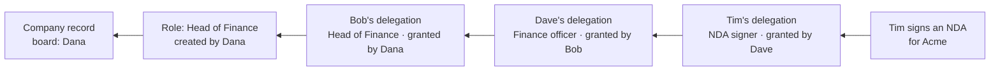
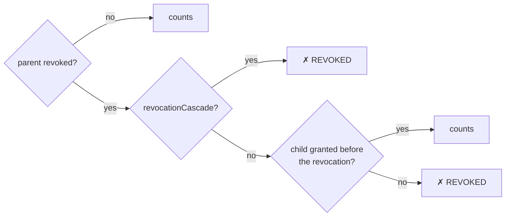

# Company Delegation

This page explains how a company signs on W3DS. A company has its own eVault. Its **directors** hand out titled **roles**, and people with a role, or a narrower slice of one, sign **for** the company. Any platform can verify such a signature by tracing it back through the company's eVault to its board.

For how a platform requests and verifies these signatures, see [Signing for a Company](/docs/Post%20Platform%20Guide/signing-for-a-company).

## The idea in one paragraph

Bob signs an NDA "for Acme" with **his own** wallet key. The signature names Acme, the delegation Bob relies on, and what he is signing. To accept it, a platform reads Acme's eVault. It checks that:

- Bob's delegation was signed by someone entitled to grant it,
- that grant goes back, hop by hop, to a role created by one of Acme's directors,
- the directors are the ones Acme's Company record was born with, or later changed to by a sitting director,
- nothing on the way was revoked before granting what is below it (or revoked with cascade),
- what was signed is within every link's **current** scopes.

**The eVault enforces none of this.** It stores whatever it is given, and all authority is decided by the verifier from signatures and the eVault's version history.



## Records

All of these live in the **company's own eVault**, are public (`acl: ["*"]`) so any verifier can read them, and are written under an id the writer picks before signing.

| Record | Ontology id | Says |
|---|---|---|
| Company | `0f9a3cb8-4a9f-4b5f-a1fa-3a4c2eb1f402` | Who the company is and its `directors[]` |
| Role | `65fd0e21-34b9-43ef-be76-c5b39727010e` | A title, the `scopes` it covers, `appLimits`, whether holders may re-delegate |
| Delegation | `0b2f15d8-c3f9-4dba-b959-5cfa11272dae` | Gives a person a role (`roleId`) or a narrower slice of a parent delegation (`parentDelegationId`) |
| Shareholding | `6382a144-5c28-450e-bf47-e37c747791c2` | A holding of shares; recorded by a director, carries no signing authority |
| DelegatedSignature | `e2736a06-176e-4004-8fda-b40b9a132669` | Audit record of a signature made for the company, written by the platform that verified it |

### Company: born with its board

- `directors` is a list of eNames.
- **Any one director** may create roles, grant delegations from a role, and revoke any delegation.
- Only a **sitting director** may change the board.
- A board only counts if the Company record's **very first version** already carries one, signed by one of its own directors. A Company record that started without directors can never acquire a board, so an existing company cannot be claimed by whoever adds directors first.
- The company's eVault `/whois` reports `type: "company"` with this record as its manifest. Verifiers start there.

### Role

- `title` is what people see, e.g. "Head of Finance".
- `scopes` says what holders may sign (see [Scopes](#scopes)).
- `mayRedelegate` says whether holders may pass a narrower slice on.
- `appLimits` holds platform-specific limits, e.g. `{ "maxAmount": 10000 }`, that the platform enforces itself.
- `createdBy` must be a director, and must be the one who signs.

### Delegation and re-delegation

Exactly one of `roleId` or `parentDelegationId` is set.

- **From a role:** granted (signed) by a director. `scopes` must be a subset of the role's.
- **From a parent delegation:** granted by the parent's delegate, only if the parent has `mayRedelegate: true`. `scopes` must be a subset of the parent's, and the validity window must lie within the parent's.
- `grantedBy` is the signer. Immutable after creation: `companyEName`, `delegateEName`, `roleId`, `parentDelegationId`, `grantedBy`.
- **Revoking:** a director, or a grantor whose own authority hasn't been revoked, writes a signed version with `status: "revoked"` and `revokedBy` set to themselves. Revocation is final. See [Firing and cascading](#firing-and-cascading).

## Scopes

A scope is either:

- `ontology:<schemaId>`: records of that ontology, or
- `@<platform-eName>:<keyword>`: a document type a platform declares, e.g. `@esigner:nda`.

**Core scopes can never be delegated.** No role or delegation may contain them, and verifiers reject them:

- identity: the UserProfile and binding-document ontologies,
- the company's own authority: Company, Shareholding, Role, Delegation, DelegatedSignature,
- anything in the reserved `@w3ds` namespace (login, key and eVault management).

## Signatures

### Grants: `w3ds-grant/v1`

Every Company, Role, Delegation and Shareholding record carries an `authorization`:

```json
{
  "signerEName": "@dana…",
  "signedPayload": "w3ds-grant/v1\n{\"companyEName\":…,\"ontology\":…,\"recordId\":…,\"recordSha256\":…,\"signedAt\":…,\"signer\":…}",
  "signature": "<P-256 signature from the signer's wallet>",
  "signedAt": "2026-10-09T07:42:04.000Z"
}
```

The signed string is short whatever the record's size, and binds:

| Field | Prevents |
|---|---|
| `recordId` | Copying the authorization onto another record |
| `recordSha256` (hash of the record without `authorization`) | Editing any field after signing |
| `signedAt` | Writing an older signed state back over a newer one |
| `companyEName`, `ontology`, `signer` | Reusing it for another company, record type or signer |

The signer's wallet signs it through an ordinary [`w3ds://sign`](/docs/W3DS%20Protocol/Signing) request: the string **is** the session. The wallet needs no changes.

### Signing for the company: `w3ds-sign/v1`

A delegate signs this payload, also sent as the `w3ds://sign` session:

```text
w3ds-sign/v1
{"delegationId":"…","documentHash":"…","issuedAt":"…","onBehalfOf":"@acme…","scope":"@esigner:nda","session":"…","signer":"@tim…"}
```

It is canonical JSON with sorted keys, exactly one valid encoding, and at most 1024 characters.

### Never a login

Every payload in this model starts with `w3ds-`. Login verifiers (`verifyLoginSignature`) refuse any session with that prefix. A signature made for a company, or over a grant, can never be replayed as a login, and a login can never claim to be on someone's behalf.

## How a verifier traces a signature

1. Parse the `w3ds-sign/v1` payload, and verify the signer's signature against their Registry-certified keys.
2. Resolve the company's eVault, and take its Company record id from `/whois` (`type` must be `company`).
3. Read the Company record's history and build the **board timeline**:
   - The first version must carry a board signed by one of its own directors.
   - Each later change counts only if signed by a director sitting at that time.
4. Resolve each link from the signer's delegation upwards. Each one is the **latest version** that:
   - is validly signed and bound to its id,
   - is not dated before the previous valid version, and not after the eVault stored it (5 minutes of clock skew allowed),
   - keeps its immutable fields,
   - was signed by someone entitled **when it was stored**:
     - a director, for roles and for grants from a role that wasn't yet revoked,
     - the delegate of a parent that wasn't yet revoked, for re-delegations,
     - a director, or a grantor whose own authority wasn't yet revoked, for revocations.

   Unsigned, forged, copied or written-back versions are skipped as if absent. Grants made by a director remain valid after that director leaves the board.

   Each resolved record also carries the eVault's storage times of its first valid grant and of its revocation. Those times decide firing, not dates the signer wrote.
5. Walk the chain to the role (at most 16 links):
   - The signer's own delegation must be active and within its validity window.
   - Every link above must be for the same company, granted by its parent's delegate, and from a parent that allows re-delegation.
   - A revoked link above still counts **if it was revoked after granting what is below it, without cascading** (see below).
6. Effective scopes are the **intersection of every link's current scopes**, role included.
7. Check the payload against the chain:
   - the right company, signer and delegation,
   - the scope is in the effective scopes,
   - the scope is not core.

### Firing and cascading

- **Revoking a person stops only them.** If Bob is fired, Bob can't sign any more. But a delegation Bob granted to Dave **before** he was fired stays valid, and so does everything Dave handed on. "Before" means the eVault stored Dave's grant before it stored Bob's revocation.
- **Revoking a role** works the same way. Holders granted before the revocation keep their delegations, and no new grants can be made from the role.
- **Cascading is explicit.** A revocation with `revocationCascade: true` also revokes everything handed on from that record. One signed record does it; the children are not touched.
- **Anything signed after the revocation doesn't count.** A fired Bob can't grant, update or revoke anything.
- **Holders below a fired link can keep handing on.** Dave can still re-delegate, if his own record allows it.
- **Narrowing always follows the parent now.** If Bob's delegation (or the role) loses invoices, everyone below Bob loses invoices at the next verification, whatever they were originally given.



### Why a trace fails

| Code | Meaning |
|---|---|
| `NOT_FOUND` | No valid version: never granted by anyone entitled, or copied from another record |
| `REVOKED` | The signer was revoked, or a link above was revoked before granting what is below it, or revoked with cascade |
| `REDELEGATION_NOT_ALLOWED` | The parent (or role) did not allow passing it on |
| `WRONG_GRANTOR` | Not granted by the parent's delegate |
| `EXPIRED` / `NOT_YET_VALID` | Outside its validity window |
| `CORE_SCOPE` | Includes a scope that can never be delegated |
| `CYCLE` / `TOO_DEEP` | Parents loop, or more than 16 links |
| `SCOPE_NOT_DELEGATED` | The chain is fine but doesn't cover what was signed |

## Limits and trade-offs

- **eVault writes are not restricted.** Anyone with write access can store records in a company's eVault. They are ignored unless properly signed, but they cost verification time.
- **History size:** a verifier reads at most 2,000 versions of any one record. Flooding a record with writes is a denial of service, never a takeover.
- **Use counts** ("sign at most N times") are not part of the model. Use validity windows, or platform-enforced `appLimits`.

## Code

- `@metastate-foundation/delegation` (`packages/delegation`): scopes, payload formats, chain evaluation, history resolution.
- `@metastate-foundation/auth` (`packages/auth`): `verifyDelegatedSignature`, `buildDelegatedSignRequest`, `buildGrantSignRequest`.
- A runnable demonstrator: `examples/company-delegation-demo`, a slide-by-slide story on the local stack.
