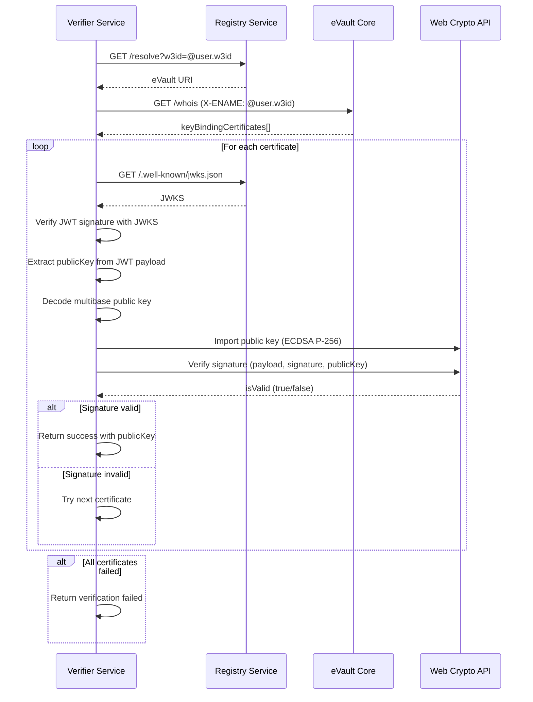
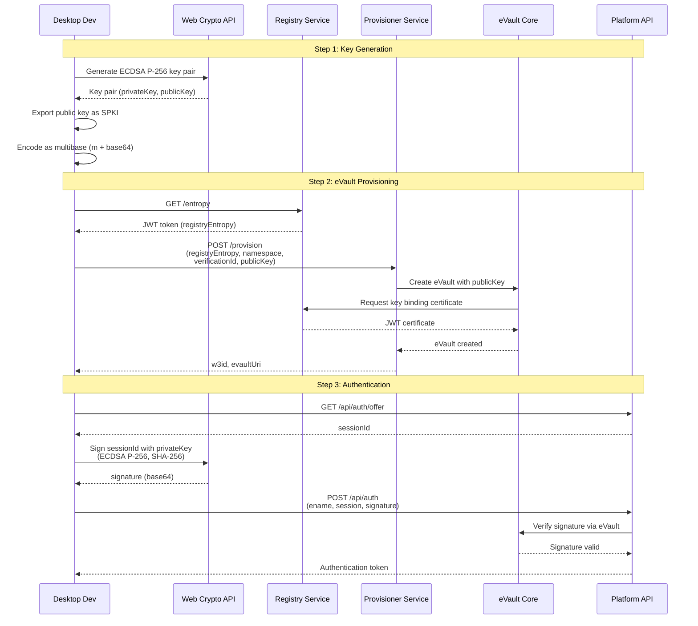
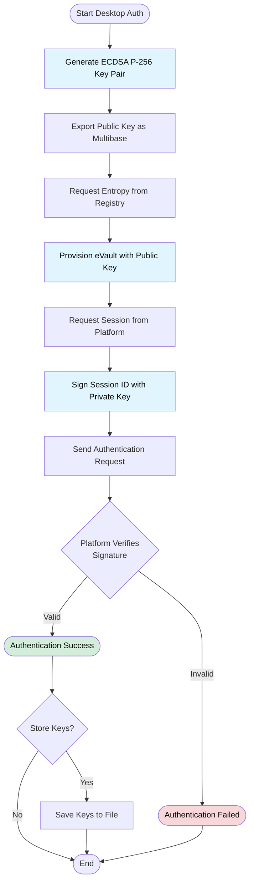

# Signatures

This document explains the signature formats used in the eID wallet and how to verify signatures using public keys from eVault.

## Overview

Signatures in the eID wallet are created using ECDSA P-256 with SHA-256 hashing. The signature format varies depending on whether a hardware or software key is used. All signatures can be verified using the public keys stored in eVault.

## Signature Formats

### Software Key Signatures

Software keys generate signatures using the Web Crypto API with ECDSA P-256 and SHA-256:

**Algorithm**: ECDSA P-256 with SHA-256  
**Format**: P1363 (raw 64-byte r||s) base64 encoded  
**Length**: 64 bytes (32 bytes for r, 32 bytes for s) when decoded

**Example:**
```
Signature: "xK3vJZQ2F3k5L8mN9pQrS7tUvW1xY3zA5bC7dE9fG1hIjKlMnOpQrStUvWxYzAbCdEfGhIjKlMnOpQrStUvWxYz=="
```

The signature is created by:
1. Encoding the payload as UTF-8
2. Signing with the private key using `crypto.subtle.sign()`, which produces a raw 64-byte signature (32-byte r concatenated with 32-byte s)
3. Converting the ArrayBuffer result to base64

### Hardware Key Signatures

Hardware keys (WebAuthn/Passkeys) generate signatures that are:

**Algorithm**: ECDSA P-256 with SHA-256  
**Format**: Multibase base58btc encoded (starts with 'z')  
**Encoding**: Can be DER format or raw format

**Example:**
```
Signature: "z3K7vJZQ2F3k5L8mN9pQrS7tUvW1xY3zA5bC7dE9fG1hIjKlMnOpQrStUvWxYz"
```

### Signature Format Detection

The signature validator automatically detects the format:

1. **DER Format**: Starts with `0x30` (SEQUENCE), contains two INTEGERs (r and s)
2. **Raw Format**: 64 bytes (32 bytes r + 32 bytes s)
3. **Multibase**: Starts with multibase prefix:
   - `z` prefix: base58btc encoding
   - `m` prefix: base64 encoding (no padding)
   - `f` prefix: base16/hex encoding (lowercase)
4. **Base64**: Standard base64/base64url encoding (no multibase prefix)

The validator normalizes DER signatures to raw format (64 bytes) before verification.

### Public Key Formats

Public keys are stored in multibase format:

**Format**: Multibase encoded with appropriate prefix
- **Base58btc**: Uses 'z' prefix (standard multibase encoding)
- **Base64**: Uses 'm' prefix (no padding)
- **Hex (base16)**: Uses 'f' prefix (lowercase)

**Example (Base58btc):**
```
Public Key: "zDnaerx9Cp5X2chPZ8n3wK7mN9pQrS7tUvW1xY3zA5bC7dE9fG1hIjKlMnOpQrStUvWxYzAbCdEfGhIjKlMnOpQrStUvWx"
```

**Example (Base64):**
```
Public Key: "mMFkwEwYHKoZIzj0CAQYIKoZIzj0DAQcDQgAEoWsGP3hdJZRcRK4ueky9lMMxZTNhJhJPZpYJ1q+4SBVbkBatjVyexZBTs7LPJRGvDCQU/FPUq/ljI7saAxkA"
```

The public key can be in two formats:
- **Raw uncompressed**: 65 bytes starting with `0x04`
- **DER SPKI**: DER-encoded SubjectPublicKeyInfo format

## Signature Verification

### Verification Flow

The verification process retrieves the public key from eVault and verifies the signature:



### Verification Steps

1. **Resolve eVault URL**: Query Registry with eName to get eVault URI
2. **Get Key Binding Certificates**: Request `/whois` endpoint from eVault
3. **Verify JWT**: Verify each certificate's signature using Registry JWKS
4. **Extract Public Key**: Get public key from JWT payload
5. **Decode Public Key**: Convert multibase format to bytes
6. **Import Public Key**: Import into Web Crypto API
7. **Verify Signature**: Use `crypto.subtle.verify()` with ECDSA P-256, SHA-256
8. **Return Result**: Return validation result with the public key used

### Using the Signature Validator

The `signature-validator` package provides a simple API for verification:

```typescript
import { verifySignature } from "signature-validator";

const result = await verifySignature({
  eName: "@user.w3id",
  signature: "z3K7vJZQ2F3k5L8mN9pQrS7tUvW1xY3zA5bC7dE9fG1hIjKlMnOpQrStUvWxYz",
  payload: "message to verify",
  registryBaseUrl: "https://registry.example.com"
});

if (result.valid) {
  console.log("Signature is valid!");
  console.log("Public key used:", result.publicKey);
} else {
  console.error("Signature invalid:", result.error);
}
```

### Verification Result

The verification function returns:

```typescript
interface VerifySignatureResult {
  valid: boolean;
  error?: string;
  publicKey?: string;
}
```

- **valid**: `true` if signature is valid, `false` otherwise
- **error**: Error message if verification failed
- **publicKey**: The public key (multibase format) that successfully verified the signature

### Multiple Certificates

eVault can store multiple key binding certificates for the same eName (e.g., from different devices). The verifier tries each certificate until one succeeds or all fail.

## Code Examples

### Creating a Signature

```typescript
// Software key signing
const keyService = new KeyService();
const signature = await keyService.signPayload(
  "default",
  "onboarding",
  "message to sign"
);
// Returns: Base64 encoded signature

// Hardware key signing (same API)
const signature = await keyService.signPayload(
  "default",
  "onboarding",
  "message to sign"
);
// Returns: Multibase encoded signature (starts with 'z')
```

### Verifying a Signature

```typescript
import { verifySignature } from "signature-validator";

const result = await verifySignature({
  eName: "@user.w3id",
  signature: "z3K7vJZQ2F3k5L8mN9pQrS7tUvW1xY3zA5bC7dE9fG1hIjKlMnOpQrStUvWxYz",
  payload: "userId_md5hash",
  registryBaseUrl: "https://registry.example.com"
});

if (result.valid) {
  // Signature is valid, proceed with operation
  console.log("Verified with public key:", result.publicKey);
} else {
  // Signature is invalid, reject operation
  throw new Error(`Signature verification failed: ${result.error}`);
}
```

## Cryptographic Details

### ECDSA P-256

- **Curve**: secp256r1 (NIST P-256)
- **Key Size**: 256 bits (32 bytes)
- **Public Key**: 65 bytes uncompressed (0x04 + 64 bytes), or DER SPKI format
- **Private Key**: 32 bytes (stored securely, never transmitted)

### SHA-256 Hashing

All signatures use SHA-256 for hashing the payload before signing:
- **Algorithm**: SHA-256
- **Output**: 256 bits (32 bytes)
- **Usage**: Hash the UTF-8 encoded payload before ECDSA signing

### Signature Components

ECDSA signatures consist of two components:
- **r**: 32 bytes (256 bits)
- **s**: 32 bytes (256 bits)
- **Total**: 64 bytes (512 bits) in raw format

## Troubleshooting

### Common Issues

1. **Signature verification fails**
   - Check that the payload matches exactly what was signed
   - Verify the eName is correct
   - Ensure the signature format is supported (base64 or multibase)
   - Check that the public key exists in eVault

2. **Key binding certificate not found**
   - Verify the public key was synced to eVault
   - Check that the Registry service is accessible
   - Ensure the eName matches the one used during key sync

3. **JWT verification fails**
   - Verify the Registry JWKS endpoint is accessible
   - Check that the certificate hasn't expired (1 hour validity)
   - Ensure the Registry's public key is correctly configured

4. **Public key import fails**
   - Verify the public key format (multibase, hex, or DER SPKI)
   - Check that the key is for ECDSA P-256 curve
   - Ensure the key is properly decoded from multibase format

### Debugging Tips

- Enable verbose logging in the signature validator
- Check the eVault `/whois` endpoint response
- Verify the Registry JWKS endpoint returns valid keys
- Inspect the JWT payload to ensure ename and publicKey are present
- Compare the signature format with expected format (base64 vs multibase)

## Security Considerations

1. **Signature Replay**: Applications should include nonces or timestamps in signed payloads to prevent replay attacks.

2. **Payload Validation**: Always verify that the signed payload matches the expected content before processing.

3. **Certificate Expiration**: Key binding certificates expire after 1 hour. Ensure your verification logic handles expired certificates gracefully.

## Desktop Development: Managing Keys Locally

For desktop development and testing, you can generate keys, create an eVault, and sign requests locally without using a mobile wallet. This section explains the algorithms and workflows for desktop-based authentication.

### Key Generation Algorithm

The key generation process uses the Web Crypto API to create an ECDSA P-256 key pair:

**Algorithm Steps:**

1. **Generate Key Pair**
   - Algorithm: ECDSA with named curve P-256 (secp256r1)
   - Key usage: `sign` and `verify`
   - Extractable: `true` (to allow exporting)

2. **Export Public Key**
   - Format: SPKI (SubjectPublicKeyInfo) DER encoding
   - Convert DER binary to base64 string
   - Prepend multibase prefix `m` to create multibase-encoded public key

3. **Store Private Key**
   - Keep private key in memory (CryptoKey object)
   - Optionally export as PKCS8 format for persistent storage
   - Never transmit or expose the private key

**Key Format:**
- **Public Key**: Multibase format `m{base64-encoded-SPKI}` (or `z{base58btc-encoded-SPKI}` for base58btc)
- **Private Key**: PKCS8 format (for storage) or CryptoKey object (for signing)

### eVault Provisioning Algorithm

The provisioning process creates an eVault tied to your generated public key:

**Algorithm Steps:**

1. **Request Entropy**
   - Send GET request to Registry `/entropy` endpoint
   - Receive JWT token containing entropy value

2. **Generate Namespace**
   - Create a UUID v4 for the namespace identifier

3. **Provision eVault**
   - Send POST request to Provisioner `/provision` endpoint with:
     - `registryEntropy`: JWT token from step 1
     - `namespace`: UUID from step 2
     - `verificationId`: Verification code (demo code or your verification ID)
     - `publicKey`: Multibase-encoded public key from key generation
   - Provisioner validates entropy, generates W3ID, creates eVault, stores public key, and requests key binding certificate from Registry

4. **Receive Credentials**
   - Receive `w3id` (eName) and `uri` (eVault URI) in response

### Signature Generation Algorithm

The signing process creates a cryptographic signature for authentication:

**Algorithm Steps:**

1. **Encode Payload**
   - Convert payload string to UTF-8 byte array

2. **Hash Payload**
   - Apply SHA-256 hashing to the UTF-8 encoded payload
   - Result: 32-byte hash digest

3. **Sign Hash**
   - Use ECDSA P-256 with the private key to sign the hash
   - Algorithm parameters: `{ name: 'ECDSA', hash: 'SHA-256' }`
   - Result: 64-byte raw signature (32 bytes r + 32 bytes s)

4. **Encode Signature**
   - Convert signature ArrayBuffer to base64 string
   - Format: Base64-encoded raw signature (software key format)

### Authentication Flow

The complete authentication workflow from key generation to platform authentication:



### Key Storage Algorithm

For persistent storage of keys on desktop:

**Storage Format:**
- **File Structure**: JSON object containing:
  - `ename`: W3ID identifier
  - `evaultUri`: eVault URI
  - `publicKey`: Multibase-encoded public key
  - `privateKey`: Base64-encoded PKCS8 private key
  - `createdAt`: ISO timestamp

**Storage Algorithm:**

1. **Export Private Key**
   - Export CryptoKey as PKCS8 format
   - Convert to base64 string

2. **Serialize Data**
   - Create JSON object with all key data
   - Stringify to JSON format

3. **Write to File**
   - Set file permissions to 0o600 (owner read/write only)
   - Write JSON to file system

**Retrieval Algorithm:**

1. **Read File**
   - Read JSON file from file system
   - Parse JSON to object

2. **Import Private Key**
   - Decode base64 private key to ArrayBuffer
   - Import as PKCS8 format with ECDSA P-256 parameters
   - Result: CryptoKey object for signing

### Complete Desktop Authentication Workflow



### Algorithm Details

#### ECDSA P-256 Key Generation

**Parameters:**
- Curve: secp256r1 (NIST P-256)
- Key size: 256 bits
- Public key size: 65 bytes uncompressed (0x04 + 64 bytes)
- Private key size: 32 bytes

**Key Export Formats:**
- **SPKI (Public)**: DER-encoded SubjectPublicKeyInfo structure
- **PKCS8 (Private)**: DER-encoded PrivateKeyInfo structure

#### Signature Algorithm

**ECDSA Signature Process:**

1. **Message Preparation**
   ```
   message → UTF-8 encoding → byte array
   ```

2. **Hashing**
   ```
   byte array → SHA-256 → 32-byte hash
   ```

3. **Signing**
   ```
   hash + privateKey + curve parameters → ECDSA sign → (r, s) tuple
   ```

4. **Encoding**
   ```
   (r, s) → concatenate → 64-byte raw signature → base64 encode
   ```

**Signature Format:**
- Raw format: 64 bytes (32 bytes r + 32 bytes s)
- Encoded: Base64 string
- Example length: ~88 characters (base64 encoding of 64 bytes)

#### Public Key Encoding

**Multibase Encoding Process:**

1. **Export Public Key**
   ```
   CryptoKey (public) → exportKey('spki') → ArrayBuffer
   ```

2. **Base64 Encode**
   ```
   ArrayBuffer → base64 string
   ```

3. **Add Multibase Prefix**
   ```
   base64 string → 'm' + base64 → multibase string
   ```

**Format:**
- Prefix: `m` (base64, no padding)
- Content: Base64-encoded SPKI DER structure
- Example: `mMFkwEwYHKoZIzj0CAQYIKoZIzj0DAQcDQgAE...` (starts with `m`)

**Alternative Formats:**
- Prefix: `z` (base58btc) - for base58btc-encoded public keys
- Prefix: `f` (base16/hex) - for hex-encoded public keys (lowercase)

### Security Considerations

1. **Private Key Protection**
   - Never commit private keys to version control
   - Use file permissions (chmod 600) to restrict access
   - Consider encrypting stored private keys with a passphrase
   - Store keys in secure location (e.g., `~/.config/` or encrypted volume)

2. **Key Generation**
   - Use cryptographically secure random number generators
   - Never reuse keys across different environments
   - Generate new keys for production vs development

3. **Environment Variables**
   - Store sensitive values (verification IDs, URLs) in environment variables
   - Never hardcode credentials in source code
   - Use `.env` files with `.gitignore`

4. **Production Usage**
   - Desktop key management is for development/testing only
   - Production should use the actual eID wallet
   - Desktop keys should never be used in production systems

### Workflow Summary

The complete desktop authentication workflow consists of four main phases:

1. **Key Generation**: Generate ECDSA P-256 key pair and export public key in multibase format
2. **eVault Provisioning**: Request entropy, provision eVault with public key, receive eName and eVault URI
3. **Session Signing**: Request session from platform, sign session ID with private key
4. **Authentication**: Send signed session to platform, receive authentication token

This workflow enables full desktop-based development and testing of authentication flows without requiring a mobile device.

## References

- [ECDSA Specification](https://tools.ietf.org/html/rfc6979)
- [Multibase Encoding](https://github.com/multiformats/multibase)
- [JWT Specification](https://tools.ietf.org/html/rfc7519)
- [Web Crypto API](https://www.w3.org/TR/WebCryptoAPI/)
