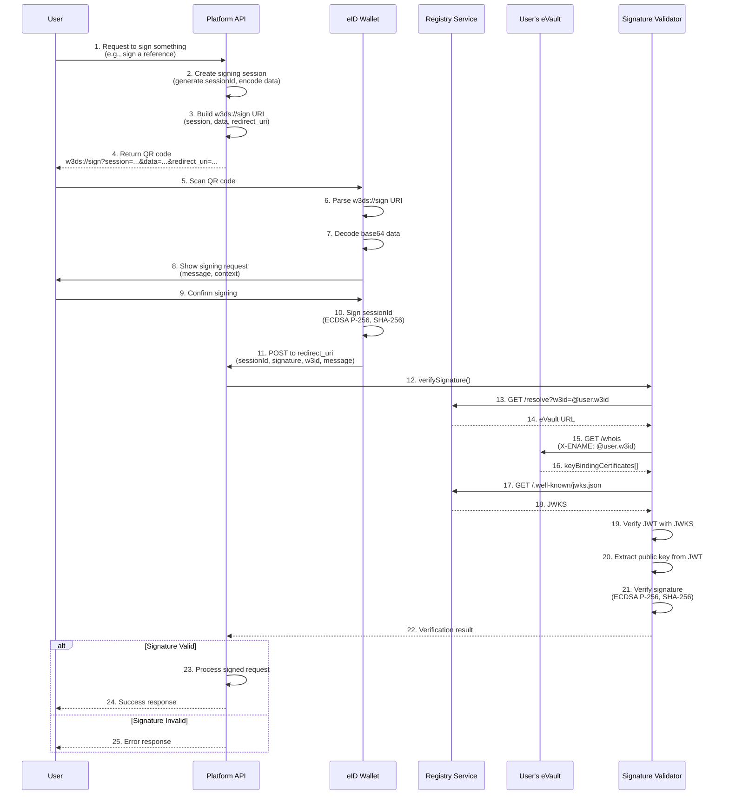
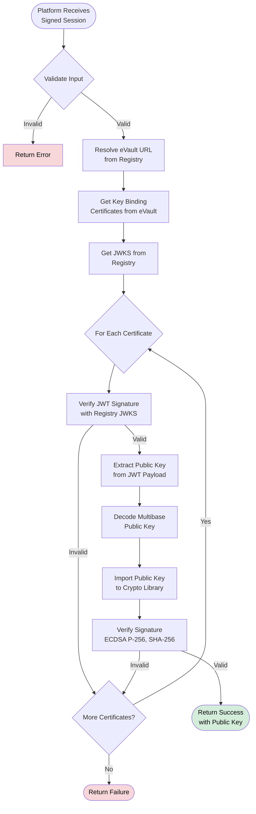

# Signing

This document explains the `w3ds://sign` protocol for requesting arbitrary signatures from users. This protocol allows platforms to request users to sign custom data such as documents, votes, references, or any other payload.

## Overview

The `w3ds://sign` protocol enables platforms to request cryptographic signatures from users through their eID wallet. Users scan a QR code containing a `w3ds://sign` URI, review what they're signing, and confirm. The wallet signs the session ID and sends it back to the platform for verification.

**Note**: This document covers arbitrary signature requests using the `w3ds://sign` protocol. For authentication signatures used during login, see the [Authentication documentation](/docs/W3DS%20Protocol/Authentication).

## Protocol Flow



### Step 1: Platform Creates Signing Session

The platform creates a signing session with:

1. **Generate Session ID**: Create a unique UUID for the signing session
2. **Prepare Data**: Create a JSON object containing:
   - `message`: Human-readable description of what's being signed
   - `sessionId`: The session UUID
   - Any additional context-specific data
3. **Encode Data**: Base64-encode the JSON string
4. **Build w3ds://sign URI**: Create URI with format:
   ```
   w3ds://sign?session={sessionId}&data={base64Data}&redirect_uri={encodedRedirectUri}
   ```
   - `session`: The session UUID
   - `data`: Base64-encoded JSON containing the message and context
   - `redirect_uri`: URL-encoded endpoint where the eID wallet will POST the signed payload (this is the callback URL)
5. **Store Session**: Store session in memory/database with expiration (typically 15 minutes)

**Implementation Requirements**:
- Generate UUID v4 for session ID
- Create JSON object with message and context data
- Base64-encode the JSON string
- URL-encode the redirect_uri parameter
- Store session with expiration time (15 minutes recommended)

**Example** (from eReputation platform - TypeScript):
```typescript
// Create signing session
const sessionId = crypto.randomUUID();
const messageData = JSON.stringify({
    message: `Sign reference for ${targetType}: ${targetName}`,
    sessionId: sessionId,
    referenceId: referenceId
});

const base64Data = Buffer.from(messageData).toString('base64');
const redirectUri = `${apiBaseUrl}/api/references/signing/callback`;

const qrData = `w3ds://sign?session=${sessionId}&data=${base64Data}&redirect_uri=${encodeURIComponent(redirectUri)}`;
```

**Language-Agnostic Implementation**:
- Use any UUID library to generate session ID (uuid in Node.js, uuid in Python, google/uuid in Go, etc.)
- Use standard JSON serialization
- Use standard base64 encoding (base64 in Python, base64 in Go, Buffer in Node.js, etc.)
- Use URL encoding for the redirect_uri parameter
- Store session in memory (Map/dictionary) or database with expiration tracking

**HTTP Endpoint**: `POST /api/{resource}/signing/session`

**Request Body**:
```json
{
    "referenceId": "ref-123",
    "referenceData": {
        "targetType": "user",
        "targetName": "John Doe",
        "content": "Great developer"
    }
}
```

**Response**:
```json
{
    "sessionId": "550e8400-e29b-41d4-a716-446655440000",
    "qrData": "w3ds://sign?session=...&data=...&redirect_uri=...",
    "expiresAt": "2025-01-24T10:15:00Z"
}
```

### Step 2: User Scans QR Code

The user scans the QR code with their eID wallet. The wallet:

1. **Parses URI**: Extracts `session`, `data`, and `redirect_uri` parameters
2. **Decodes Data**: Base64-decodes the data to get the JSON message
3. **Displays Request**: Shows the user what they're signing (message, context)
4. **Waits for Confirmation**: User reviews and confirms

### Step 3: Wallet Signs the Session ID

When the user confirms:

1. **Get Session ID**: Extract session ID from the URI parameters
2. **Sign Session ID**: Sign the session ID string (not the full data) using:
   - Key ID: `"default"`
   - Context: `"onboarding"` (real users) or `"pre-verification"` (test users)
   - Algorithm: ECDSA P-256 with SHA-256
3. **Encode Signature**: Base64 (software keys) or multibase (hardware keys)

**Important**: The wallet signs the **session ID**, not the decoded data. The platform uses the session ID to look up the original context.

### Step 4: eID Wallet POSTs Signed Payload

After the user confirms signing, the eID wallet makes an HTTP POST request to the `redirect_uri` specified in the `w3ds://sign` URI. The platform receives this POST request with the signed payload:

**Endpoint**: The `redirect_uri` from the `w3ds://sign` URI (e.g., `POST /api/references/signing/callback`)

**What the eID Wallet POSTs**:
```http
POST {redirect_uri} HTTP/1.1
Content-Type: application/json

{
    "sessionId": "550e8400-e29b-41d4-a716-446655440000",
    "signature": "xK3vJZQ2F3k5L8mN9pQrS7tUvW1xY3zA5bC7dE9fG1hIjKlMnOpQrStUvWxYz==",
    "w3id": "@user-a.w3id",
    "message": "550e8400-e29b-41d4-a716-446655440000"
}
```

**Field Descriptions**:
- `sessionId`: The session UUID from the signing request
- `signature`: The base64 or multibase-encoded signature of the session ID
- `w3id`: The user's eName (W3ID)
- `message`: The session ID that was signed (for verification)

### Step 5: Platform Receives and Verifies Signed Payload

The platform receives the POST request from the eID wallet at the `redirect_uri` endpoint and:

1. **Validate Input**: Check all required fields are present
2. **Lookup Session**: Retrieve the signing session using `sessionId`
3. **Verify Session**: Check session is still valid (not expired, status is "pending")
4. **Verify Signature**: Use signature verification (see [Signature Verification](#signature-verification)) with:
   - eName: `w3id` from request
   - Signature: `signature` from request
   - Payload: `message` (session ID) from request
5. **Verify User**: Ensure the signing user matches the expected user (security check)
6. **Process Request**: Perform the action (record signature, update status, etc.)
7. **Update Session**: Mark session as "completed" or "security_violation"

**Implementation Requirements**:
- Parse JSON request body
- Validate all required fields (sessionId, signature, w3id, message)
- Lookup session from storage using sessionId
- Check session validity (exists, not expired, status is "pending")
- Verify signature using signature verification process
- Verify user identity matches expected user
- Process the signed request (update database, trigger actions, etc.)
- Update session status
- Return appropriate HTTP response

**Example Implementation** (from eReputation - TypeScript):
```typescript
async handleSignedPayload(req: Request, res: Response) {
    const { sessionId, signature, w3id, message } = req.body;

    // Validate required fields
    if (!sessionId || !signature || !w3id || !message) {
        return res.status(400).json({ error: "Missing required fields" });
    }

    // Process the signed payload
    const result = await signingService.processSignedPayload(
        sessionId,
        signature,
        w3id,
        message
    );

    if (result.success) {
        res.json({ success: true, data: result });
    } else {
        res.status(200).json({ 
            success: false, 
            error: result.error 
        });
    }
}
```

**Language-Agnostic Implementation**:
- Use any HTTP server framework (Express, FastAPI, Gin, etc.)
- Parse JSON from request body
- Use signature verification library or implement verification (see [Signature Verification](#signature-verification))
- Store sessions in memory (Map/dictionary) or database
- Implement session expiration checking
- Return JSON responses with appropriate HTTP status codes

### Security Considerations

1. **Session Expiration**: Sessions should expire after a reasonable time (15 minutes recommended)
2. **One-Time Use**: Each session ID should only be used once
3. **User Verification**: Verify that the signing user matches the expected user
4. **Signature Verification**: Always verify signatures using eVault before processing
5. **Payload Validation**: Ensure the signed message (session ID) matches the stored session

### Use Cases

- **Document Signing**: Sign contracts, agreements, or documents
- **Voting**: Sign votes in polls or elections
- **References**: Sign references or recommendations
- **Approvals**: Sign approvals for actions or requests
- **Custom Actions**: Any platform-specific signing requirement

## Signature Verification

Signature verification is a multi-step process that platforms must implement. The platform verifies that a signature was created by the user who owns a specific eName.

### Overview

The verification process:
1. Resolve eVault URL from Registry using eName
2. Fetch key binding certificates from eVault
3. Verify JWT certificates using Registry's public keys
4. Extract public keys from verified certificates
5. Verify signature using the public key

### Step 1: Resolve eVault URL

Make an HTTP GET request to the Registry service:

**Request**:
```
GET {registryBaseUrl}/resolve?w3id=@user-a.w3id
```

**Response**:
```json
{
    "evaultUrl": "https://evault.example.com/users/user-a"
}
```

**Implementation**: Use any HTTP client library. Parse the JSON response to extract the `evaultUrl` field. Handle network errors and timeouts appropriately.

### Step 2: Get Key Binding Certificates

Make an HTTP GET request to the eVault's `/whois` endpoint:

**Request**:
```
GET {evaultUrl}/whois
Headers:
  X-ENAME: @user-a.w3id
```

**Response**:
```json
{
    "keyBindingCertificates": [
        "eyJhbGciOiJFUzI1NiIsInR5cCI6IkpXVCJ9...",
        "eyJhbGciOiJFUzI1NiIsInR5cCI6IkpXVCJ9..."
    ]
}
```

Key binding certificates are JWTs that contain:
- The user's eName
- The user's public key (multibase encoded)
- Expiration time (1 hour validity)
- Signature from Registry

### Step 3: Verify JWT Certificates

For each certificate, perform these steps:

1. **Fetch Registry JWKS**: Make HTTP GET request to `{registryBaseUrl}/.well-known/jwks.json`. The response is a JSON object containing public keys in JWK (JSON Web Key) format.

2. **Parse JWT**: Split the JWT into three parts (header.payload.signature) using '.' as delimiter. Base64url-decode the header and payload.

3. **Verify JWT Signature**: 
   - Find the matching key from JWKS using the `kid` (key ID) from JWT header
   - The JWT is signed with ECDSA P-256 using the Registry's private key
   - Verify the signature using the corresponding public key from JWKS
   - Use a JWT library in your language or implement ECDSA verification manually

4. **Check Expiration**: Verify the `exp` claim in the JWT payload. Certificates have 1-hour validity.

5. **Extract Public Key**: Get the `publicKey` field from the JWT payload. This is the user's public key in multibase format.

**JWT Payload Structure**:
```json
{
    "ename": "@user-a.w3id",
    "publicKey": "zDnaerx9Cp5X2chPZ8n3wK7mN9pQrS7tUvW1xY3zA5bC7dE9fG1hIjKlMnOpQrStUvWxYz",
    "exp": 1737734400,
    "iat": 1737730800
}
```

**Library Requirements**: JWT library that supports ECDSA P-256 verification (most JWT libraries do: jose in Node.js, PyJWT in Python, jwt-go in Go, etc.)

### Step 4: Decode Public Key

The public key from the JWT is in multibase format. Decode it based on the first character:

- **'z' prefix**: base58btc encoding - use a base58btc decoder library
- **'m' prefix**: base64 encoding - use standard base64 decoder
- **'f' prefix**: hex encoding - decode hex string to bytes

After decoding, the public key should be in one of these formats:
- **SPKI DER format**: DER-encoded SubjectPublicKeyInfo structure (most common)
- **Raw uncompressed**: 65 bytes starting with 0x04 followed by 64 bytes of coordinates

**Library Requirements**: 
- Multibase decoder (or implement base58btc/base64/hex decoding)
- ASN.1 parser if the key is in DER format (most crypto libraries handle this automatically)

### Step 5: Verify Signature

Use your language's cryptographic library to verify the ECDSA signature:

1. **Import Public Key**: Load the decoded public key into your crypto library. Most libraries accept:
   - SPKI DER format (preferred)
   - Raw uncompressed format (65 bytes)
   - PEM format (if your library supports it)

2. **Prepare the Message**: 
   - Convert the payload string (e.g., session ID) to UTF-8 bytes
   - Compute SHA-256 hash of the bytes (produces 32-byte hash)

3. **Decode Signature**: 
   - If base64: decode to get 64-byte raw signature
   - If multibase (starts with 'z'): decode base58btc first, then check if DER format
   - If DER format: parse to extract r and s values, pad to 32 bytes each, concatenate to 64 bytes

4. **Verify**: Use ECDSA verify function with:
   - Algorithm: ECDSA
   - Curve: P-256 (secp256r1, prime256v1)
   - Hash: SHA-256
   - Public key: The imported key
   - Signature: 64-byte raw format (r || s)
   - Message: The 32-byte SHA-256 hash

5. **Return Result**: If any certificate's public key successfully verifies the signature, verification succeeds.

**Library Examples**:
- **Python**: `cryptography.hazmat.primitives.asymmetric.ec.ECDSA` with `SHA256`
- **Go**: `crypto/ecdsa` and `crypto/sha256` packages
- **Java**: `java.security.Signature` with "SHA256withECDSA"
- **Rust**: `p256` crate or `ring` crate
- **Node.js**: `crypto.subtle` (Web Crypto API) or `node:crypto`
- **C#**: `System.Security.Cryptography.ECDsa` class

### Step 6: Return Result

The verification function should return a result indicating whether the signature is valid:

```typescript
interface VerifySignatureResult {
    valid: boolean;
    error?: string;
    publicKey?: string; // The public key that successfully verified
}
```

## Complete Verification Flow Diagram



## Using the Signature Validator

If you're using the TypeScript `signature-validator` package, verification is simplified:

```typescript
import { verifySignature } from "signature-validator";

const verificationResult = await verifySignature({
    eName: "@user-a.w3id",
    signature: "xK3vJZQ2F3k5L8mN9pQrS7tUvW1xY3zA5bC7dE9fG1hIjKlMnOpQrStUvWxYz==",
    payload: "550e8400-e29b-41d4-a716-446655440000",
    registryBaseUrl: "https://registry.example.com"
});

if (verificationResult.valid) {
    // Signature is valid
    console.log("Verified with public key:", verificationResult.publicKey);
} else {
    // Signature is invalid
    console.error("Verification failed:", verificationResult.error);
}
```

## Signature Formats

W3DS supports multiple signature formats:

- **Software Keys**: Base64-encoded raw 64-byte signatures
- **Hardware Keys**: Multibase base58btc-encoded signatures (starts with 'z')

For detailed information on signature formats, encoding, and edge cases, see the [Signature Formats documentation](/docs/W3DS%20Protocol/Signature-Formats).

## Library Requirements

To implement signature verification, you'll need:

- **HTTP client** for API requests (Registry and eVault)
- **JWT library** for parsing and verifying JWTs (supports ECDSA P-256)
- **ECDSA library** (most crypto libraries: OpenSSL, crypto in Node.js, cryptography in Python, etc.)
- **Base64/base58btc decoder** for signature and public key decoding
- **SHA-256 hashing** (usually included in crypto libraries)
- **ASN.1 parser** (for DER format keys, usually included in crypto libraries)

## Troubleshooting

### Common Issues

1. **Signature verification fails**
   - Check that the payload matches exactly what was signed
   - Verify the eName is correct
   - Ensure the signature format is supported (base64 or multibase)
   - Check that the public key exists in eVault

2. **Key binding certificate not found**
   - Verify the public key was synced to eVault
   - Check that the Registry service is accessible
   - Ensure the eName matches the one used during key sync

3. **JWT verification fails**
   - Verify the Registry JWKS endpoint is accessible
   - Check that the certificate hasn't expired (1 hour validity)
   - Ensure the Registry's public key is correctly configured

4. **Public key import fails**
   - Verify the public key format (multibase, hex, or DER SPKI)
   - Check that the key is for ECDSA P-256 curve
   - Ensure the key is properly decoded from multibase format

5. **Signature format issues**
   - Check if signature is DER format and convert to raw if needed
   - Verify base64/multibase decoding is correct
   - Ensure signature is exactly 64 bytes after decoding

## References

- [Authentication](/docs/W3DS%20Protocol/Authentication) - How authentication uses signatures
- [Signature Formats](/docs/W3DS%20Protocol/Signature-Formats) - Detailed signature format documentation
- [ECDSA Specification](https://tools.ietf.org/html/rfc6979) - ECDSA algorithm details
- [JWT Specification](https://tools.ietf.org/html/rfc7519) - JSON Web Token format
- [Web Crypto API](https://www.w3.org/TR/WebCryptoAPI/) - Browser cryptographic API
