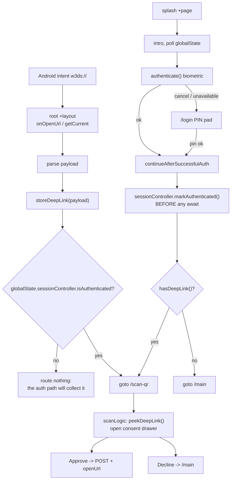

# Deep-link login

How a `w3ds://` login request from a third-party site reaches the
Approve/Decline consent screen.

## The problem

A platform (Pictique, Blabsy, ...) shows a login QR. The user scans it with the
system camera or taps it, and Android hands the wallet a URL:

```
w3ds://auth?session=<uuid>&platform=<name>&redirect=<origin>
```

Showing the consent screen for that URL requires two independent things to
finish, in an order nobody controls:

1. **The URL arriving.** The root layout imports the deep-link plugin
   asynchronously, then asks it for the launch URL.
2. **The user authenticating.** On a cold start the splash prompts for
   biometrics, which can succeed in ~200ms or take several seconds.

Neither reliably happens first. On a cold start with a fingerprint already on
the sensor, authentication wins. On a slower unlock, the URL wins.

## The design: whoever finishes last routes

Both sides check the same two explicitly-recorded facts, so neither can act on
a half-finished picture:

- **The URL arrives while unauthenticated** — store it, route nothing. The
  screen that completes authentication picks it up.
- **The URL arrives while already authenticated** — route to the consent screen
  immediately.
- **Authentication completes** — if a payload is stored, go to `/scan-qr`;
  otherwise `/main`.



## One payload slot

Storing a deep link never implies permission to act on it. That is
`globalState.sessionController.isAuthenticated`, which every consumer checks anyway.

An earlier version had two slots, `pendingDeepLink` and `deepLinkData`, and
"promoted" between them once the user authenticated. The copy carried no
information: the payload was byte-identical on both sides, and the only
difference was a label meaning "actionable now". The duplication leaked
outward — `/scan-qr` read one key and fell back to the other, then had to clear
both, and any reader forgetting a key was a silent bug.

## Why authentication is recorded explicitly

The original implementation asked
`isAuthenticatedRoute(window.location.pathname)` at the instant of delivery, as
a proxy for "has the user authenticated?".

That is unsound on a cold start. The path is `/` (the splash) regardless of how
the race went, so a user who had **already** authenticated was still classified
as logged out. The payload was stored for a screen that had finished running,
nothing collected it, and the user landed on `/main` with the consent screen
never shown. That was the bug this design replaces.

Authentication state is therefore written by the code that performs the
authentication, and never derived from the URL or the route.

`sessionController.markAuthenticated()` must be called **before any await** that precedes the
caller's navigation. A deep link delivered while post-login chores are in
flight has to see the user as authenticated, or it will store a payload nobody
is left to collect.

## Storage choice

`sessionStorage`, deliberately — not a Svelte store, not `localStorage`, and
not an in-memory field on the controller.

- **A Svelte store is in-memory.** This state has to survive the full-page
  navigations the wallet performs between the splash, `/login` and `/scan-qr`.
  An in-memory store is empty on the other side.
- **`localStorage` would survive the app being killed**, which is exactly wrong
  for the authenticated flag. A deep link arriving after a cold start must
  trigger a real authentication rather than inheriting one from a previous run.
  Being forgotten on relaunch is the property that makes it safe.
- **An in-memory field would not survive the WEBVIEW being rebuilt**, which is
  a different event from the app being killed. Android may reload the webview
  while the app is backgrounded by `openUrl`, and the approve path does a
  document navigation to the platform's redirect. Neither is a new run of the
  app, and the flow has no way to re-prompt mid-handoff, so the user would be
  stranded. `SessionController` therefore takes no store and reads
  sessionStorage directly.

Every accessor degrades to "nothing stored" when storage is unavailable
(private mode, storage disabled) rather than throwing, because these run inside
deep-link callbacks where a throw is invisible to the user and strands the flow.

## Logout

`GlobalState.reset()` clears both keys. This is required, not defensive: logout
does `goto("/")`, an SPA navigation that leaves `sessionStorage` intact. Without
it the session would keep claiming the user is authenticated, and the next deep
link would route straight to the consent screen on the strength of a login that
had already ended.

## The splash is the only biometric prompt

`/login` is the PIN fallback. The splash prompts for biometrics and routes
onward itself; it does not divert a deep-link launch to `/login`, because doing
so would downgrade a returning user to the PIN pad for the flow most likely to
be used in a hurry.

Two consequences worth knowing:

- The splash's async `onMount` carries liveness checks (`destroyed`). Unmounting
  a Svelte component does not cancel a continuation parked on an `await`, so it
  could otherwise wake after the consent drawer opened and navigate away from it.
- `/login` still prompts biometrics when the splash did not, coordinated through
  the `biometricAttemptedOnSplash` flag inherited from the original design.

## What authentication actually means here

Worth stating plainly, because the names are misleading.

| Fact | Question it answers | Lifetime |
|---|---|---|
| `vaultController.vault` | Is an identity **enrolled** on this device? | Disk, survives reboot |
| `securityController.pinHash` | Is a PIN **configured**? | Disk |
| `walletAuthenticated` | Has the user authenticated **this session**? | sessionStorage |

`walletAuthenticated` is owned by `GlobalState.sessionController`, alongside the
other controllers. It is the session's authentication state, not a deep-link
concept; the deep-link flow is simply its only reader today. `lib/stores/deepLink.ts`
owns only the pending payload.

The `(app)` route guard checks the **vault**, i.e. enrolment, not
authentication. It stops a never-onboarded or logged-out user; it does not stop
an unauthenticated one, since a cold-start user has a vault sitting on disk.

What actually forces authentication on a cold start is that the splash owns the
only normal path into `(app)`, plus the fact that `walletAuthenticated` dies
with the webview. A deep link is a **second door** into the app, which is why it
needs an explicit flag to consult rather than relying on that implicit
guarantee.

## Known gaps

- **Not covered by tests:** vitest here is node-only and mounts no Svelte
  components, so the specs pin this module's semantics, not the call sites in
  `.svelte` files. Device testing via `pnpm build:apk` is the only real proof.
- **PIN change and passphrase rotation** have not been traced. If either ends a
  session without going through `globalState.reset()`, the authenticated flag
  would survive when it should not.
- **The Ok confirmation card is not shown after a deep-link login.** Approving
  runs `goto("/main")` before `openUrl`, which unmounts the page that owns the
  drawer, and the subsequent Activity restart wipes `sessionStorage` anyway.
  This is pre-existing behaviour, unrelated to the race, and still open.
