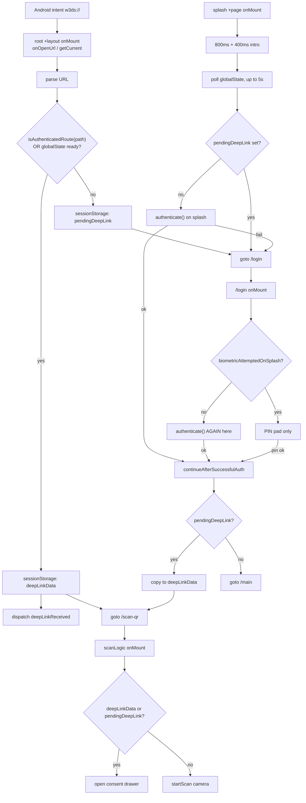
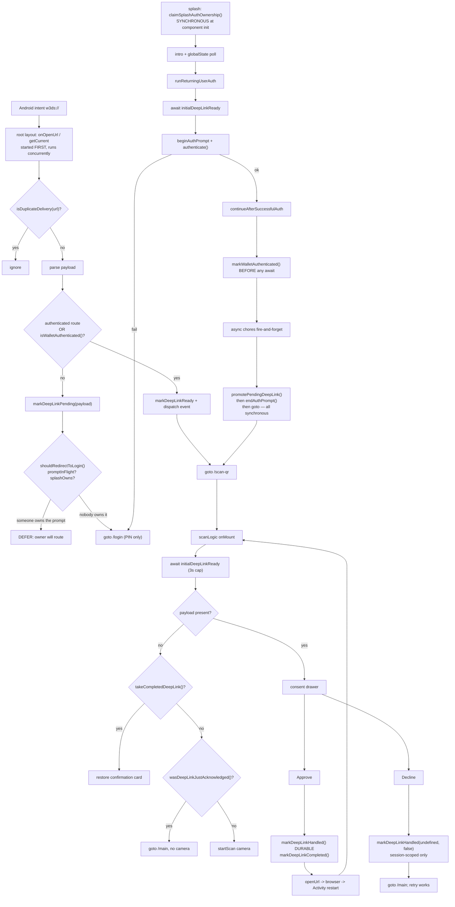

# Deep-link login: architecture before and after

Scope: the `w3ds://` third-party login flow in the eID wallet. This document
describes the architecture that existed at merge-base `b29340c5`, the
architecture that exists now on `fix/eid-wallet-cold-start-deeplink-race`, how
data moves through each, and the reason behind every change.

Audience: whoever maintains this next. The intent is that you can reason about
the flow without re-deriving it from the diff.

---

## 1. What the flow has to do

A third-party site (Pictique, Blabsy, ...) shows a login QR. The user scans it
with the system camera or taps it, and Android hands the wallet a URL:

```
w3ds://auth?session=<uuid>&redirect=<origin>
```

The wallet must:

1. Receive the URL, whatever state the app is in (not running, backgrounded,
   foregrounded, already on the scanner).
2. Make sure the user is authenticated (biometric, or PIN as fallback).
3. Show an **Approve / Decline** consent screen naming the requesting site.
4. On approve, POST the user's eName to the platform and open the platform in
   the browser.
5. Show a confirmation card with an **Ok** button when the user comes back.

Four properties make this harder than it looks, and every design decision below
traces back to one of them:

- **P1 — Cold start is a race.** The URL arrives via an async plugin import
  while the splash screen is independently deciding where to navigate. Either
  can win.
- **P2 — Android delivers a cold-start URL twice.** Once through `getCurrent()`
  and once through `onOpenUrl`. Both fire for a single user action.
- **P3 — `openUrl` can destroy the webview.** Handing off to the browser
  backgrounds the app; Android may reload the webview, wiping `sessionStorage`.
  The Activity is `singleTask`, so the deep-link plugin then **replays the
  original intent** into a fresh webview that has no memory of it.
- **P4 — The URL is not unique per launch.** Platforms mint one `session` per
  *offer*, and the login QR only refreshes every 60s. A user retrying a login
  presents a byte-identical URL. "Seen this URL before" therefore cannot mean
  "ignore forever".

---

## 2. Architecture BEFORE (`b29340c5`)

### 2.1 Components

| Component | Responsibility |
|---|---|
| `routes/+layout.svelte` | Registers `onOpenUrl` + `getCurrent`, parses URL, decides route |
| `routes/+page.svelte` (splash) | Intro animation, then biometric prompt for returning users |
| `routes/(auth)/login/+page.svelte` | PIN pad **and its own biometric prompt** |
| `lib/utils/postLogin.ts` | Shared post-auth chores, then route to deep link or `/main` |
| `routes/(app)/+layout.svelte` | Auth guard: vault must exist or bounce to `/login` |
| `routes/(app)/scan-qr/scanLogic.ts` | Consent drawers, approve/decline, camera |

State lived in three raw `sessionStorage` keys, written inline at each call
site with no shared module:

- `pendingDeepLink` — payload parked because the user is not authenticated yet
- `deepLinkData` — payload ready for `/scan-qr` to consume
- `biometricAttemptedOnSplash` — handshake so `/login` could skip re-prompting

### 2.2 Data flow



### 2.3 How it worked, and where it broke

On the **warm path** it worked fine. App already open and authenticated: the
handler saw an authenticated route, wrote `deepLinkData`, dispatched the event,
and `/scan-qr` opened the drawer. That path was never broken and is essentially
unchanged today.

The **cold path** was where it failed, and the failure was a genuine race
(P1). Two independent `onMount` routines:

- The layout imports the deep-link plugin asynchronously, then discovers the URL.
- The splash sleeps 1.2s, polls for `globalState`, then prompts biometrics.

The splash's guard against the collision was to check `pendingDeepLink` and
divert to `/login`, deferring to `/login` as the single authenticator. **That
guard depends on the layout winning the race.** With fast biometrics — a user
whose finger is already on the sensor — the ordering inverted:

```
splash: reads pendingDeepLink -> empty (layout still importing)
splash: authenticate() -> success in ~200ms
splash: continueAfterSuccessfulAuth -> no pendingDeepLink -> goto /main
layout: URL finally arrives, writes pendingDeepLink, goto /login
(app) guard / login: user is already authenticated -> /main
result: payload parked forever, consent screen never appears
```

That is the original bug. The payload is written *after* the only code that
would have read it.

### 2.4 What the original did NOT have

Worth stating plainly, because it explains why the branch grew so long:

- **No dedupe of any kind.** P2's double delivery was handled accidentally: the
  second delivery overwrote `deepLinkData` with an identical payload, and
  `/scan-qr` was idempotent about opening an already-open drawer.
- **No durable storage.** Nothing survived the P3 webview teardown. Coming back
  from the browser showed a bare scanner instead of a confirmation card.
- **No concept of "this login is finished".**
- **No suppression window**, so the 30s window did not exist, and declining
  recorded nothing. A declined login could always be retried immediately.

That last point matters: the retry-after-decline bug was **introduced by this
branch**, not fixed by it. See §4.8.

---

## 3. Architecture AFTER

### 3.1 The central change: one module owns the protocol

All deep-link state moved into `lib/utils/deepLinkFlow.ts` (~560 lines,
heavily commented, 56 unit tests). Call sites no longer touch `sessionStorage`
directly. The module owns which store each fact lives in, and that distinction
is the core of the design:

| Store | Survives | Holds |
|---|---|---|
| `sessionStorage` | SPA navigation only. Wiped by webview teardown. | `pendingDeepLink`, `deepLinkData`, `walletAuthenticated`, `walletAuthInFlight`, `splashOwnsAuthPrompt`, `deepLinkLastUrl` |
| `localStorage` | Webview teardown and Activity restart | `deepLinkHandledUrl`, `deepLinkHandledAt`, `deepLinkCompleted`, `deepLinkAcknowledgedAt` |

The rule: **only facts needed to survive the P3 restart are durable.**
Emphatically *not* `walletAuthenticated` — making that durable would let a deep
link arriving after a full app kill skip authentication entirely. Being
forgotten on relaunch is the property that makes it safe.

### 3.2 Data flow now



### 3.3 The three invariants everything else follows from

**I1 — Exactly one screen prompts for biometrics: the splash.**
`/login` is now the PIN fallback and never calls `authenticate()`. Two prompt
sites made the system dialog's backdrop non-deterministic and let two post-auth
routines race to consume one payload.

**I2 — Ownership of the auth prompt is an explicit claim, never inferred.**
Two flags, both in `sessionStorage`:
- `walletAuthInFlight` — a native prompt is on screen right now
  (`beginAuthPrompt` / `endAuthPrompt`)
- `splashOwnsAuthPrompt` — the splash is mounted and will prompt, or is
  mid-handover (`claimSplashAuthOwnership` / `releaseSplashAuthOwnership`)

`shouldRedirectToLogin()` returns false if either is set. The handler parks the
payload and lets the owner route.

**I3 — The handover from auth to consent is synchronous.**
In `continueAfterSuccessfulAuth`, everything from `promotePendingDeepLink()`
through `endAuthPrompt()` to `goto()` runs with no `await` between. Any await in
that window is a gap where a re-delivered URL sees no owner and fires a
competing navigation.

---

## 4. Every change, and why

### 4.1 Wait for deep-link discovery before deciding (`ac69802c`, `6fb30e58`)

**Problem:** the original bug (§2.3) — the splash decided "no deep link" before
the layout had finished discovering one.

**Change:** the layout exposes `initialDeepLinkReady`, a promise resolved once
`getCurrent()` and listener registration have both completed. It is provided via
Svelte context. The splash awaits it before choosing a destination; `/scan-qr`
awaits it too, capped at 3s so a plugin failure cannot leave a blank page.

**Why a promise rather than a flag:** the splash needs to *wait*, not poll. A
flag would reintroduce the same race at a different granularity.

### 4.2 Single biometric prompt site (`504903d7`)

**Problem:** `/login` and the splash each prompted from their own `onMount`.
Whichever won decided whether the dialog appeared over the purple splash or a
half-painted PIN pad. Worse, both could run `continueAfterSuccessfulAuth`, and
two post-auth routines consuming one payload is how it got dropped.

**Change:** `/login` no longer calls `authenticate()`. The splash no longer
diverts a deep-link launch to `/login`. The routing decision was extracted into
`shouldRedirectToLogin()` so it is unit-testable. Deleted the now-dead
`biometricAttemptedOnSplash` handshake.

**Trade-off, stated honestly:** a user who cancels biometrics gets the PIN pad
with no way to retry biometrics without relaunching. That was true before for
deep-link launches; it is now true for all launches.

### 4.3 Ownership as an explicit claim (`b9eb573b`, `c8cc4487`)

**Problem:** `shouldRedirectToLogin` originally inferred "the splash owns the
prompt" from `currentPath === "/"`. Unsound in both directions. After the
handover released the bracket, a re-delivered URL still saw `"/"` until the
`goto` landed, so the handler deferred to an owner that no longer existed and
the payload was parked forever.

**Change (`b9eb573b`):** replaced the path inference with the explicit
`splashOwnsAuthPrompt` claim, and removed the path parameter entirely.

**That was not enough (`c8cc4487`).** The reported symptom after `b9eb573b` was
that the PIN pad sometimes appeared *instead of* biometrics, which was
diagnostic: the claim ran ~1.2s after mount, after the intro and the globalState
poll, but the deep link is delivered from the layout's `onMount` inside that
window. The handler saw no owner, did `goto("/login")`, and unmounted the splash
before it could prompt.

Fixed by claiming **synchronously at component init**, before any await, with
release on every non-authenticating exit plus `onDestroy`.
`runReturningUserAuth()` was extracted so there is a single release point.

**Principle:** a claim that is established after an await is not a claim, it is
a race with extra steps.

### 4.4 Stale continuation guard (`d95c8398`, `0ccaae0c`, `a0b37b0f`)

**Problem:** unmounting a Svelte component does not cancel an `onMount` parked
on an await. The splash's continuation would resume long after the user had
left and call `goto()`, tearing down an open consent drawer.

**Change:** `shouldAbortStaleContinuation(destroyed, authenticatedAtStart)`.

**The subtlety:** the first version tested `isWalletAuthenticated()` alone. That
broke `/login`, because arriving there already-authenticated (exactly what a
deep-link flow does) made a freshly mounted screen classify itself as stale, so
it returned before prompting. The question is "was this routine *superseded*
while it waited?", which is not "is the session authenticated?". Callers now
snapshot auth state at start and pass it back; only a *transition* counts.

### 4.5 Dedupe with a bounded window (`78c9ce82`, `a380cb09`, `60cc2941`)

**Problem:** P2 — Android delivers cold-start URLs through both `getCurrent()`
and `onOpenUrl`.

**Change:** `isDuplicateDelivery(url)` compares against the last-seen URL.

**Why bounded (`a380cb09`):** the first version was a permanent blacklist, which
collided with P4. Since platforms reuse one `session` per offer, a user retrying
a pending login presents an identical URL, and it was silently swallowed — the
approval screen simply never appeared again. Hence `REPLAY_WINDOW_MS = 30_000`:
long enough to cover the Activity restart, short enough that the same link
later reads as the new request it is.

### 4.6 Surviving the Activity restart (`c9a7af2a`, `c3c80b7f`, `687807e0`)

**Problem:** P3. Approving calls `openUrl`; Android reloads the backgrounded
webview and wipes `sessionStorage`; the plugin replays the original intent into
a fresh webview. Two symptoms: the finished login was re-offered, and the
confirmation card was gone.

**Change:** dedupe markers moved to `localStorage`; `markDeepLinkCompleted()`
stores platform, hostname and redirect durably so the rebuilt webview can
reconstruct the confirmation card (`takeCompletedDeepLink()`).

The hostname was added in `687807e0` because the app icon is resolved from it,
so restoring the name alone rendered the card with a blank logo.

### 4.7 Acknowledgement, so Ok does not open the camera (`6feacb49`)

**Problem:** tapping Ok before the Activity restart landed left no trace. The
rebuilt webview found no payload and started the camera — a scanner the user
never asked for.

**Change:** an `acknowledged` flag on `takeCompletedDeepLink()`, a durable
`ACKNOWLEDGED_KEY`, and `wasDeepLinkJustAcknowledged()`. `/scan-qr` returns to
`/main` instead of scanning. `clearDeepLinkAcknowledged()` is called from the root
layout's `onNavigate` when the user deliberately taps Scan. A webview rebuild is
a fresh page load and never fires that hook, so clearing there cannot mask the
case the marker guards.

**Load-bearing detail:** the acknowledgement is written *before* the single-use
read. Mutation testing proved that ordering matters — swapping them lets the
read consume the record before the flag is stamped.

### 4.8 Decline must not block a retry (`70c9bdb9`)

**Problem, and it was mine.** Declining recorded the URL as handled *durably*,
so retrying the same link within 30s was dropped as a duplicate and the user
landed on `/main` with no consent screen — the original symptom, different
cause. In the original code decline recorded nothing at all, so retry always
worked (§2.4).

**Root cause:** I applied approve-shaped reasoning to decline without checking
the premise. The durable marker exists solely to survive the Activity restart
that `openUrl` causes. **Decline never calls `openUrl`**, so no restart is
coming and there is nothing to survive. The marker outlived the decision.

**Change:** `markDeepLinkHandled(urlString?, durable = true)`. Decline and the
in-app QR-scan POST path pass `false` — session-scoped only, which still
collapses the P2 double delivery within the current webview. Approve stays
durable.

### 4.9 Refresh the window on Ok (`d45489d4`)

**Problem:** a duplicate pending-login prompt after a slow browser round-trip.

**Investigation:** `HANDLED_AT` is stamped at approval — before `openUrl`,
before time spent on the platform, before the Activity restart. A slow
round-trip exhausted the 30s window, so the replay was no longer recognised as
one. A probe against the real module confirmed suppression works *within* the
window, which is what pointed at expiry.

**Change:** tapping Ok refreshes `HANDLED_AT`, guarded so it fires only when
`acknowledged=true` and a handled URL already exists.

### 4.10 Startup latency (`12983713`)

**Problem:** user-reported slowness before biometrics.

**Finding:** auditing the whole diff against `b29340c5` showed the 800ms/400ms
intro and the polling loops were all pre-existing. What I had added was
`await initialDeepLinkReady` at the end of a serial chain: `checkStatus()` →
`GlobalState.create()` → `import(deep-link)` → `onOpenUrl`/`getCurrent()`.

**Change:** deep-link discovery starts first and runs concurrently.
`GlobalState.create()` no longer waits on `checkStatus()` — verified that
`runtime.biometry` is written but never read anywhere.

---

## 5. Comparison

| Concern | Before | After |
|---|---|---|
| Deep-link state | 3 raw keys, inline at call sites | `deepLinkFlow.ts`, 56 tests |
| Biometric prompt sites | 2 (splash + `/login`), racing | 1 (splash) |
| Prompt ownership | Inferred from pathname | Explicit claim, sync at init |
| Cold-start ordering | Unsynchronised race | `initialDeepLinkReady` promise |
| Double delivery (P2) | Accidentally idempotent | Explicit, 30s bounded |
| Webview teardown (P3) | Not handled; card lost | Durable markers + restore |
| Retry same URL (P4) | Worked (nothing recorded) | Works (window + non-durable decline) |
| Post-`openUrl` return | Bare scanner | Confirmation card, or `/main` if acked |

---

## 6. Honest limitations

**Test coverage does not reach the call sites.** vitest here is node-only and
mounts no Svelte components. The 56 tests pin the *semantics* of
`deepLinkFlow.ts` — mutating it kills tests reliably. But flipping the
production decline call in `+page.svelte` back to `markDeepLinkHandled()`
**passes the entire suite**. That one line is verified by reading it, not by a
test. The same applies to every other call site in `.svelte` files.

**Device testing is the only real proof.** `pnpm build:apk`. The races here are
between native plugin delivery and Svelte lifecycle, and neither exists in node.

**The 30s window is a heuristic.** It is not derived from a measured
distribution of Activity restart latency. §4.9 exists because it was too short
for a slow round-trip. If the duplicate-prompt symptom returns, the window is
the first suspect, and the right fix is probably to stop relying on wall-clock
time and key the marker to something restart-scoped instead.

**Known-unfixed, deliberately left alone:** `(auth)/+layout.svelte` references
`bg-background` and `text-foreground-muted`, neither defined in the `@theme`
block in `app.css` (verified: 0 rules in the compiled output), so the loading
placeholder is transparent. Also the eVault 429 recovery-screen error.

**This branch is 27 commits for one bug.** Most of the later ones fix
regressions introduced by earlier ones. The pattern in the failures was
consistent: asserting a timing or causal relationship without verifying it —
inferring ownership from a pathname, claiming ownership after an await,
assuming decline needed the same durability as approve. Checking `b29340c5`
first would have caught several of them immediately, since in most cases the
original code simply did not do the thing I was "preserving".

---

## 7. Reference

**Diagnostics in logcat:**
- `Deep link routing:` — prints `authPromptInFlight` and `splashOwnsAuth`
- `Deferring navigation: the auth prompt owner will route`
- `Duplicate deep link delivery ignored:`
- `Restoring post-login confirmation after app restart`
- `Deep link already acknowledged, returning to main`

**Key files:**
- `src/lib/utils/deepLinkFlow.ts` — protocol, storage, all decisions
- `src/lib/utils/deepLinkFlow.spec.ts` — 56 tests
- `src/routes/+layout.svelte` — delivery, dedupe, routing
- `src/routes/+page.svelte` — splash, the only biometric prompt
- `src/lib/utils/postLogin.ts` — the synchronous handover
- `src/routes/(app)/scan-qr/scanLogic.ts` — consent, approve/decline, restore
