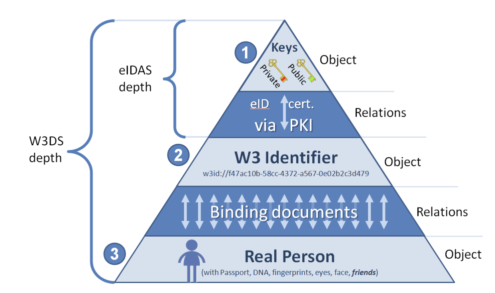

# W3ID

The metastate ecosystem has the only 1 type of identifiers, W3ID (did:w3id protocol, defined below) for all types of entities, e.g..

- Users & Groups: Users and groups would have a persistent, unchanging identifier which is referred to as Web 3 Identifier
  In case of a person, the W3ID is the life-long anchor which connects keys and the physical essence of a person. It is represented on the diagram below
  (1-2 relations) personal W3ID and personal keys via eID certificate from PKI
  (2-3 relations) personal W3ID and body characteristics, physical passport and friends.
- Mobile Devices (or Device ID): Mobile devices would use a persistent (within the lifetime of the device) W3ID identifier within the ecosystem.
  eVault: An eVault would use its own unique W3ID, which is not shared with a user, but rather is used internally to sync data between clone eVaults and used internally by an eVault hosting provider.
- W3 Envelope: W3 Envelope would use a W3ID, which is globally unique, and this W3ID would be used in the W3ID URI scheme to retrieve a envelope.
